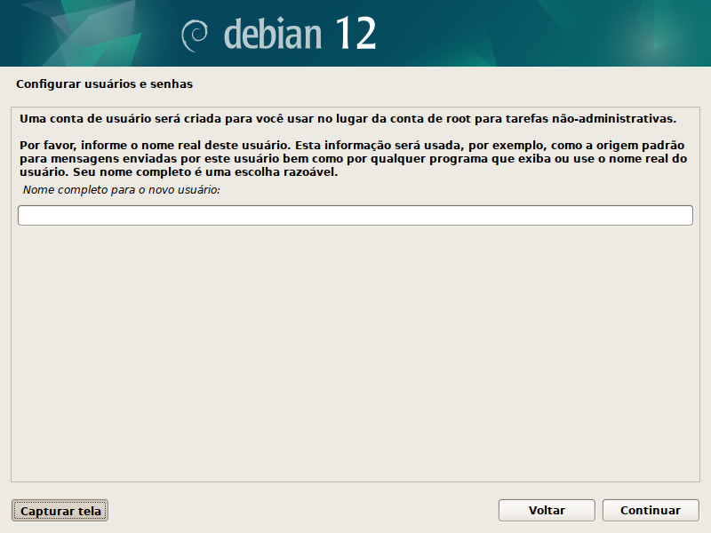

# Instalação do Debian Minimal e Openbox - OPENBOX RAIZ 

Guia de passo a passo para instalação mínima do Linux Debian com Openbox:

## 1. Baixar ISO Debian Netinst:
	Site para baixar a ISO do Debian (2 alternativas):
	https://www.debian.org/distrib/index.pt.html
	https://www.debian.org/CD/netinst/

*Para 64 bits: amd64*

	https://cdimage.debian.org/debian-cd/current/amd64/iso-cd/debian-12.4.0-amd64-netinst.iso
	
*Para 32 bits: i386*

	https://cdimage.debian.org/debian-cd/current/i386/iso-cd/debian-12.4.0-i386-netinst.iso

## 2. Criar USB instalador (desde outra máquina)

	- Instalar programa para criar USB instalador. No Terminal:
		sudo apt install gnome-multi-writer

	- Insere o Pendrive na máquina
	- Abre desde o Terminal: gnome-multi-writer
	- Clica no ícone de abrir pasta
	- Escolhe a imagem ISO baixada de Debian para que seja copiada no pendrive.

Caso não se autorize acessar o pendrive, chamar o programa como root:

`sudo gnome-multi-writer`

## 3. Instalar o Debian Minimal na máquina nova: 

- Verificar se a BIOS está configurada para iniciar o sistema desde o USB.
- Conectar cabo de rede (Ethernet).
- Conectar USB com a ISO do Debian na máquina e ligá-la.

Telas da instalação:

- País, idiomas do sistema e teclado

- Conectando rede (ethernet ou wifi)

- Nome da máquina

- Nome do dominio = vazio

- Senha do root (opcional) 
 *-Não colocando senha no Root, a senha do usuário que se cadastrará primeiro, será a mesma para root e não será necessário configurar o sudo su.

- Nome do usuário

- Senha do usuário

- Estado do Brasil - para configuraçao de horário.

- Particionar discos (Sim/Nao) = N

- Particionar discos - Usar disco o inteiro

- Escolhe o disco (NÃO o USB!!)

- Todos os arquivos em uma partição

- Finalizar o particionamento e escrever as mudanças no disco

- Confirma a partição (formatação e criação do disco com Debian) = Sim

(Começa a instalação do sistema).

- Configurar o gerenciador de pacotes = país (EEUU) + url + proxy (vazio)

- Participar da pesquisa sobre pacotes = não

- Seleção de software/interface gráficas - XFCE, etc... = somente utilitários de sistema padrão.

(Prossegue a instalação do sistema)...

- Grub: Instalar no disco primário? = Sim

- Local do Grub = SSD

- Finalizar instalação = Continuar (REMOVER O USB APÓS TELA PRETA DE REBOOT)

Próximo passo: [2 - Instalar pacotes essenciais para o Openbox](2-Pacotes-essenciais.md)

