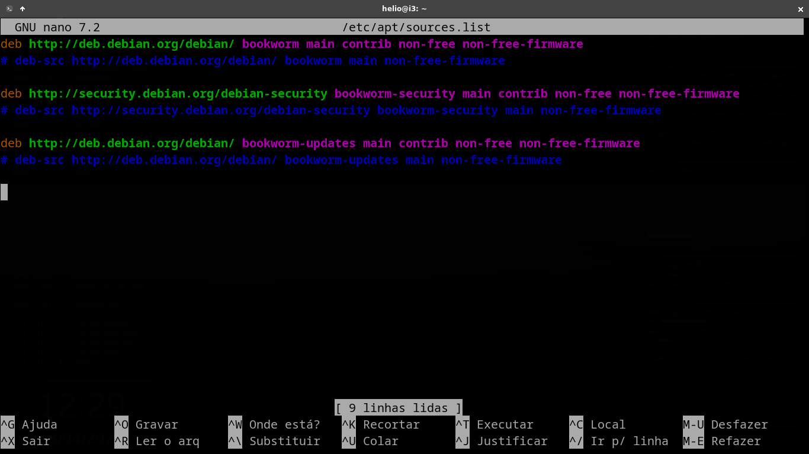

# Pós-instalação

### 1 - Configurando o sources.list
No Terminal abre o sources list:

```bash
sudo nano /etc/apt/sources.list
```

Muda as seguintes linhas para os valores:

- Apaga todas as linhas comentadas.
- Comenta todas as linhas que começam com: deb-src http... (sobre pacotes de códigos fonte - desnecessários).
- Acrescenta *contrib non-free* entre: main e non-free-firmware nas três linhas.

**A versão final do arquivo tem que estar assim:**



- Salva e sai.

- Atualiza tudo:

```bash
sudo apt update
```

### 2 - Instalando pacotes mínimos

Para informações dos pacotes a seguir, dar comando:
```bash
sudo apt show ...
```


**Instalação via script:**

(Opção mais rápida) 

Instale apenas o comando `curl` e, em seguida, execute o seguinte comando desde o Terminal:

`curl https://raw.githubusercontent.com/HelioGiroto/Brincando-com-o-Terminal/refs/heads/master/Debian%20Minimal%20%2B%20Openbox/instala_pacotes_basicos.sh | bash`


Após isso, para rodar o Openbox, reinicie a máquina ou dê o comando:

```bash
startx
```

Com isso acima, já evita de instalar tudo o que se segue deste passo-a-passo.

---

**Instalação de todos os comandos sem script (acima)**

Os pacotes indispensáveis para o funcionamento do Openbox são:

```bash
sudo apt install xorg xinit openbox obconf lxterminal aptitude slim tint2 menu nitrogen compton thunar arandr rofi git xterm
```

Depois, para rodar o Openbox, o comando (ou reinicia a máquina):

```bash
startx
```

Outros pacotes essenciais a serem instalados: 

```bash
sudo apt install vim tmux ranger gedit chromium simplescreenrecorder audacity gcc cheese conky bc gawk sed grep lynx curl wget html-xml-utils xclip googler ffmpeg imagemagick speedtest-cli youtube-dl nmap numix-icon-theme-circle espeak mbrola gnumeric galculator abiword shotwell htop mc mupdf mpack ssmtp mplayer alpine wkhtmltopdf gpick gnome-tweaks gnome-sushi gnome-multi-writer wdiff colordiff tint2 feh fswebcam dialog jq xtrlock mate-utils pavucontrol calendar whois bsdmainutils onboard pdfgrep numlockx lxappearance vlc python3-pip mirage plank xserver-xorg-input-synaptics nodejs npm pandoc texlive-luatex texlive-latex-extra gnome-control-center mediainfo mp3info mpv xdotool youtube-dl neofetch default-jre detox obs-studio network-manager tlp tlp-rdw rfkill wmctrl detox obconf jgmenu

```

Pronto!

FONTE: https://raw.githubusercontent.com/HelioGiroto/Brincando-com-o-Terminal/master/openbox/como-instalar-openbox.md


OBS.: Falta: Configurar lxappearance e obconf (?)

---

**Próximo passo: [3 - Configurar sistema](3-Configurar-Openbox.md)**


