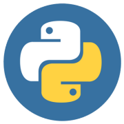

# Python <span id='topo'></span>

A linguagem Python foi lançada em 1991. Desenvolvida por Guido van Rossum.

> Python é uma linguagem de propósito geral de alto nível, multiparadigma, suporta o paradigma orientado a objetos, imperativo, funcional e procedural. Possui tipagem dinâmica e uma de suas principais características é permitir a fácil leitura do código e exigir poucas linhas de código se comparado ao mesmo programa em outras linguagens. Devido às suas características, ela é utilizada, principalmente, para processamento de textos, dados científicos e criação de CGIs para páginas dinâmicas para a web. Foi considerada pelo público a 3ª linguagem "mais amada", de acordo com uma pesquisa conduzida pelo site Stack Overflow em 2018 e está entre as 5 linguagens mais populares, de acordo com uma pesquisa conduzida pela RedMonk. _(fonte: Wikipedia)_

Possivelmente, as características mais marcantes da linguagem sejam: a simplicidade, facilidade para aprendê-la, elegância no seu estilo e ampla conexão com milhares de bibliotecas (módulos) que tornam o Python uma linguagem capaz de realizar praticamente tudo no universo computacional, na área científica e pesquisa, na matemática e estatística, na inteligência artificial, na interação com APIs, na integração com outros programas como planilhas e processadores de texto, computação gráfica, gerenciamento de arquivos, na facilidade de conexão com outras linguagens: como C (por exemplo), em análise de dados, em desenvolvimento de gráficos estatísticos, no WebScraping, no desenvolvimento de programas e aplicativos para desktop, Mobile e Web, no uso com banco de dados, de redes, nas aplicações de OSINT e segurança da informação, no reconhecimento de imagens, na Internet das coisas (IoT), robótica e mecatrônica, desenvolvimento de jogos e muitos outros. 

Tudo isso, rodando em todos os sistemas operacionais, como por exemplo: Linux, FreeBSD, MacOS, Android, Windows, etc. \[ em ordem de importância :D ].

A documentação oficial da linguagem está em:

https://docs.python.org/pt-br/3.13/tutorial/index.html .

Mas, existem outras fontes confiáveis de aprendizado e consulta, como:

https://www.w3schools.com/python/		- Site da W3C

https://pense-python.caravela.club/		- Tradução do livro "Pense em Python"

https://automatetheboringstuff.com/ 		- Livro "Automatize tarefas maçantes com Python - em inglês."

## Índice:

(Ao clicar sobre o nome de um dos temas abaixo retornará ao topo).


## <a class="up" href="#topo"> MODOS DE EXECUÇÃO </a> 

Existem dois modos de execução em Python: O Script e o Interativo.

O modo script é quando desde o Terminal (ou Shell do DOS) se executa o interpretador do Python para ler um código que anteriormente desenvolvemos e salvamos em nosso computador:

`python3 codigo.py`

Já o modo interativo, é quando dentro do Python executamos comandos um a um (no prompt do Python):

```
$ python3
Python 3.11.2 (main, Aug 26 2024, 07:20:54) [GCC 12.2.0] on linux
Type "help", "copyright", "credits" or "license" for more information.
>>> 
```

Sendo assim, todos os comandos que podemos executar ou testar em Python, ao invés de criarmos um script para cada, se pode executar os comandos dentro da linha de comandos (interna) do Python, ou seja: no "prompt" do Python. Neste tutorial, sempre que encontrarmos uma sintaxe com este símbolo (**>>>**), significa que se está executando um comando dentro do prompt. Por exemplo:

```
>>> print("Hello World!")
```

Também se pode fazer testes usando o navegador e alguma plataforma que roda uma IDE de Python de maneira "online" (playground), como:
 - https://www.online-python.com
 - https://www.programiz.com/python-programming/online-compiler
 - https://colab.research.google.com

entre outras...


## <a class="up" href="#topo"> CLI OU GUI </a> 

"Command-Line Interface" ou "Graphical User Interface"?

Os scripts feitos em Python são normalmente executados em CLI, porém existem opções GUI, ou seja, para criar programas com interface gráfica, tais como: 
Tkinter, PyQt, PySide, Kivy, WxPython e outras.

## <a class="up" href="#topo"> SHEBANG: INICIO DO PROGRAMA </a> 

```python
# funciona em qualquer sistema porque procura onde o interpretador está:
#!/usr/bin/env python3

# No caso de estar o interpretador num diretório que se sabe o path:
#!/usr/bin/python3

# para uma versão específica:
#!/usr/bin/env python3.11
```


## <a class="up" href="#topo"> COMENTÁRIOS </a> 
Comentários em uma linha, se usa o símbolo: #.

```python
# comentário... 
# comentário... 
```

Comentários em bloco, se usa três aspas: """ """:

```python
"""
aqui
é um bloco
de comentários
"""
```


## <a class="up" href="#topo"> EXTENSÃO DE SCRIPTS EM PYTHON</a> 
Se salva um script em Python com a extensão `.py`, como por exemplo: `nome_arquivo.py`. 


## <a class="up" href="#topo"> EXECUTANDO UM SCRIPT   </a> 

A maneira mais simples para rodar um script em Python, é na linha de comando digitar o seguinte comando do Terminal (ou Shell do DOS):

`python3 script.py`

Onde `script.py` é o nome do script.


## <a class="up" href="#topo"> SINTAXE DE COMANDOS NO SCRIPT  </a> 

Dentro do script em Python é obrigatório o uso de indentação em caso de funções e/ou laços para demarcar o bloco de comandos.


## <a class="up" href="#topo"> OPERAÇÕES E OPERADORES ARITMÉTICOS </a> 
```python
# soma:
40 + 2
# subtração:
43 - 1
# multiplicação:
7 * 3
# divisão:
12 / 4
# resto da divisão:
15 % 4
# exponenciação:
3 ** 2
# raiz quadrada:
9**0.5
# ou:
import math
math.sqrt(9)

# também funciona com variáveis:
x = 10
y = 12
z = x + y
print(z)

# operações mais complexas (se calcula 1o. o que está entre parêntesis):
24/(4*3)  # isso é diferente disto:
24/4*3

# A ordem das operações é: Parêntesis, Exponenciação, Multiplicação, Divisão, Adição, Subtração.
# e quando operadores se repetem, o interpretador prioriza na sequência da esquerda para a direita. 

# incremento (ver no tópico próprio mais abaixo):
nro = 10
nro += 1

# decremento:
nro -= 1

# arredondar:
round(3.141592653589793, 2)	# 3.14
round(3.141592653589793, 4)	# 3.1416

resultado = 150.251224
print(f'{resultado:.2f}')	# 150.25

# cálculo com decimais:
3.14159 * 2.5

# ver - https://pense-python.caravela.club/03-funcoes/02-funcoes-matematicas.html 
```


## <a class="up" href="#topo"> ENTRADA DE DADOS 1: Variáveis </a> 

```python
>>> mensagem = "Isto é uma mensagem, uma frase, ou qualquer coisa que queira."
>>> n = 12
>>> pi = 3.141592653589793
```

Nomes de variáveis podem ser tão longos quanto você queira. Podem conter tanto letras como números, mas não podem começar com um número. É legal usar letras maiúsculas, mas a convenção é usar apenas letras minúsculas para nomes de variáveis. Se aceita o underline (_), mas não caracteres especiais ou palavras reservadas.

OBS.: A linguagem Python é uma linguagem tipada, ou seja, faz diferença entre tipos de variáveis. Por ex.:

```python
# digite:
>>> type('2')
>>> type(2)
>>> type(2.00)
>>> type([2,3,4])
>>> type((2,3,4))
```


### Para converter de um tipo para outro:

```python
pi = "3.14"
type(pi) 		# str

pi = float(pi)		# Converte a float porque inteiro 3.14 não pode ser!!
type(pi) 		# integer

nro = -2
type(nro)

str(nro)
type(nro)		# nro se torna string

int(nro)
type(nro)		# volta a ser inteiro

pi = 3.14
nro = int(pi)		# ele trunca o valor (retirando os decimais)
print(nro)		# resultado: 3

```

## <a class="up" href="#topo"> INCREMENTOS </a> 

Incrementos em variáveis são expressões que ao serem usadas alteram o valor numérico de uma variável. 

```python
nro = 10
nro+=1	# incrementa 1
nro-=1	# decrementa 1
nro*=2	# multiplica por 2
nro/=2	# divide por 2

# pode ser um incremento de várias strings:
for reposta in string_total_texto += resposta
```

## <a class="up" href="#topo"> IMPRIMIR NA TELA </a> 

Para imprimir uma string, valor ou número em tela usamos o comando `print`.

```python
print("Olá mundo!")

print(10+20)

nome = "José da Silva"
print(nome)

# imprime 4 vezes a mesma string:
print('Olá '*4)

# imprime com uma quebra de linha:
print('Bem-vindo!\n')

# usando 3 áspas simples podemos imprimir um texto com quebra de linhas:
print('''
Frase 1
	Frase 2
Frase 3
''')

# resultado igual ao de cima:
texto = '''
Frase 1
	Frase 2
Frase 3
'''
print(texto)

```


## <a class="up" href="#topo"> ENTRADA DE DADOS 2: Comando Input </a> 

Inputs sempre armazenam na memória valores strings. Caso seja necessário usar números, é preciso converter o valor da variável paa inteiro. 


```python
# input sempre recebe valor string do usuário:
nome = input('Digite o seu nome para começarmos: ')

# recebe valor, mas o converte para número inteiro:
numero = int(input('Digite um número: '))
```


## <a class="up" href="#topo"> CONCATENAÇÃO </a> 


```python
# a forma mais simples - usando o +:
nome = "Helio"
print('Bem-vindo ' + nome + ' ao nosso ChatBot!')
print('Bem-vindo', nome, 'ao nosso ChatBot!')

# forma mais recente no Python:
pergunta = input(f'Olá, {nome}. O que você gostaria de saber? ')	# Formatação com f-string
print(f'Essa foi a sua pergunta: {pergunta}')		# Formatação com f-string
```


## <a class="up" href="#topo"> ENTRADA DE DADOS 3: Parâmetros em linha do Terminal  </a>

É possível em Python passar parâmetros a fim de que a entrada de dados seja por meio de dados fornecidos desde a linha de comando quando o script é chamado:

Exemplo de como chama o `programa.py` onde se passa dois parâmetros:

`python3 programa.py Maria 25`

O `programa.py` contém o seguinte código:

```python
import sys

if len(sys.argv) < 3:
    print("Passe dois parâmetros separados por espaço e use áspas duplas caso seja uma string com mais de uma palavra")
    sys.exit(1)

nome = sys.argv[1]
idade = int(sys.argv[2])

print(f"Olá, {nome}! Você tem {idade} anos.")

```


## <a class="up" href="#topo"> MANIPULAÇÃO DE STRINGS</a> 
ver daí em diante - https://pense-python.caravela.club/08-strings/01-uma-string-e-uma-sequencia.html

Métodos para string:
https://www.w3schools.com/python/python_strings_methods.asp

Regex:
https://www.w3schools.com/python/python_regex.asp


## <a class="up" href="#topo"> TESTE DE CONDIÇÕES </a> 

Aqui estão os principais operadores de comparação:

`==` (igual a): Verifica se dois valores são iguais. Exemplo: 5 == 5 resulta em True.

`!=` (diferente de): Verifica se dois valores são diferentes. Exemplo: 5 != 3 resulta em True.

`>` (maior que): Verifica se o valor à esquerda é maior que o valor à direita. Exemplo: 7 > 3 resulta em True.

`<` (menor que): Verifica se o valor à esquerda é menor que o valor à direita. Exemplo: 2 < 5 resulta em True.

`>=` (maior ou igual a): Verifica se o valor à esquerda é maior ou igual ao valor à direita. Exemplo: 4 >= 4 resulta em True.

`<=` (menor ou igual a): Verifica se o valor à esquerda é menor ou igual ao valor à direita. Exemplo: 3 <= 5 resulta em True.

Esses operadores são fundamentais para tomar decisões no código, como em condicionais (if) e loops, onde o programa precisa comparar valores para determinar qual ação executar a seguir.


## <a class="up" href="#topo"> CONDIÇÕES IF, ELIF, ELSE... </a> 

### If único 

Um `if` sempre está acompanhado de um operador de comparação: 

```python 
if nome == 'Ana':
	print('O nome dela é Ana.')
```

Outro exemplo: 

```python 
x=4
if 0 < x < 10:
    print('x está entre 0 e 10.')

# agora tente o seguinte e rode o if novamente:
x=-2
x=11
 
```
### If e else 

Else aparece quando a condição de `if` não foi satisfeita. Se tal condição se cumpra, faça isso; caso contrário aquilo... 

Um `else` nunca vem acompanhado de uma condição:

```python
pergunta = input('Digite x se você quiser sair: ')
if pergunta == 'x':
  print('sair')
else:
  print('continuar')
```

#### Usando operadores lógicos (and, or e not):

Exemplo para evitar que o usuário responda com caixa alta e dê erro:

```python
pergunta = input('Digite x se você quiser sair: ')
if pergunta.lower() == 'x':
  print('sair')
else:
  print('continuar')
```

**Outros operadores lógicos:**

- `and`: Retorna True se todas as condições forem verdadeiras.
- `or`: Retorna True se pelo menos uma das condições for verdadeira.
- `not`: Inverte o valor de uma condição, transformando True em False e vice-versa.

Exemplo usando o `or`:

```python 
pergunta = input('Digite x se você quiser sair: ')
if pergunta == 'x' or pergunta == "X":
  print('sair')
else:
  print('continuar')

```

Exemplo usando o `and`:

```python
pergunta = input('Digite x se você quiser sair: ')
confirmacao = input('Digite x para confirmar: ')
if pergunta == 'x' and confirmacao == 'x':
	print('ok para as duas condições')
```

Exemplo usando o operador `not`:

```python
>>> estah_ativo = True
>>> estah_ativo
True
>>> not estah_ativo
False
```

### If, elif, else

Às vezes, são necessárias mais que uma condição para serem testadas, assim, se usa a instrução `elif` (que precisa trazer consigo uma outra condição:

```python 
if x < y:
    print('x é menor que y')
elif x > y:
    print('x é maior que y')
else:
    print('x e y são iguais')
```


## <a class="up" href="#topo"> OPÇÕES EM CASOS - Criação de menús </a> 

Há duas maneiras de criar um menú de interação com o usuário do seu programa: Usando `if's` ou o `match...case`:

**Criando um menú usando if's**

```python
# Três áspas simples (''') criam uma variável string 
# que pode ser escrita em várias linhas 
# e que o Python assume as devidas quebras de linha:

texto_selecao = '''
Digite 1 para opção 1
Digite 2 para opção 2
Digite 3 para opção 3
'''

while True:
	selecao = input(texto_selecao)
	if selecao == '1':
		print('Você escolheu a opção 1\n')
		break
	if selecao == '2':
		print('Você escolheu a opção 2\n')
		break
	if selecao == '3':
		print('Você escolheu a opção 3\n')
		break
	print('Digite um valor entre 1 e 3')
```


**Criando um menú usando match...case**

```python 
escolha = input('Digite a opção de 1 a 3: ')
match escolha:
	case "1":
		print("Opção 1")
	case "2":
		print("Opção 2")
	case "3":
		print("Opção 3")
	case _:
		print("Opção inválida")
```

A instrução acima `case _:` é o bloco que executará caso nenhuma das opções anteriores foi escolhida.

**Usando match...case para combinar valores:**

```python
day = 4
match day:
	case 1 | 2 | 3 | 4 | 5:
		print("Today is a weekday")
	case 6 | 7:
		print("I love weekends!")
```

**Usando match...case com mais de uma condição:**

```python
month = 5
day = 4
match day:
	case 1 | 2 | 3 | 4 | 5 if month == 4:
		print("A weekday in April")
	case 1 | 2 | 3 | 4 | 5 if month == 5:
		print("A weekday in May")
	case _:
		print("No match")
```


## <a class="up" href="#topo"> LISTAS </a> 

Em Python temos algumas formas de definir variáveis que trazem vários valores. 

Elas são:

 - Listas
 - Tuplas
 - Conjuntos (Sets)
 - Dicionários

```python
mensagens = ['Oi', 'Tudo bem?', 'Tudo ótimo, e com você?', 'Comigo tudo ótimo também']

# imprime toda a lista:
print(mensagens)

# imprime o 1o. elemento:
print(mensagens[0])

# imprime o último elemento:
print(mensagens[-1])

```

Uma lista pode conter outra lista dentro dela. E nesse caso, para se obter o valor de um item dela, se usa:

```python
lista = [0, 1, 2, ['a', 'b', 'c']]
lista[3][1]
# 'b'
```


## <a class="up" href="#topo"> MANIPULAÇÃO DE LISTAS </a>

Veremos agora os métodos (funções) que se pode usar para manipular listas. Lembrando que listas, diferentemente de variáveis strings, são alteráveis. 

**len() - Obtendo o tamanho da lista**

```python
lista = [1,2,3,4,5]
print(len(lista))
5
```


**Fatiando uma lista**

Formato se baseia em nome da lista, colchetes, dois números separados por ":", sendo o primeiro a posição (em índice) do primeiro elemento até o segundo número o elemento em ordem da lista:

```python
lista = [1,2,3,4,5]

# cria uma outra lista de lista 
# fatiando da posição 0 até o 3o. item:
sub_lista = lista[0:3]

# fatia desde a posição 0 até o 4o. item:
lista2 = lista[:4]

# Desde o item de índice 2 (o 3o item) até o último
lista3 = lista[2:]

# Desde a primeira posição até a última (ou seja, a lista inteira)
listaB = lista[:]

# Desde o elementode index 2 até o último (-1)
lista_nova = lista[2:-1]

# Desde o elemento de index 0 até o penúltimo (-2 = segundo de trás para frente).
lista4 = lista[0:-2]

```


**Adicionando valores a uma lista**

No Python é possível concatenar valores ou listas à própria lista, "appendar" ou inserir itens, conforme estes exemplos abaixo:

```python
# primeiro modo mais simples - concatenando:
lista1 = [0,1,2,3]
lista2 = [4,5,6,7]
nro = 8
lista_nova = lista1 + lista2 + nro

# usando a função append() - acrescenta ao final da lista:
lista.append('Mais um valor na lista')

# outra forma de fazer um 'append':
lista = [1,2,3]
lista += [4,5]
print(lista)	# [1, 2, 3, 4, 5]


# acrescentando ao inicio da lista - posição 0:
lista.insert(0, "novoitem")

# insere na posição 2
lista.insert(2, 'outro item')
```

A função `insert()` permite que se escolha o número do índice que o novo elemento será inserido. Não substituindo, mas inserindo-o e movendo os demais para depois dele.


Se pode criar uma lista (global) vazia e a medida que o código é executado, serão 'appendados' valores a esta lista vazia criada anteriormente. 

```python 
# cria lista vazia:
numeros_impares = []
print("Digite 0 para sair\n")

while resposta != 0:
	# pede um número ao usuário:
	resposta = int(input('Digite um número: '))

	# se o número é impar, adiciona nro em lista:
	if resposta % 2 > 0:
		numeros_impares.append(resposta)

```

**Substituindo valores de uma lista**

```python
lista = [0,1,2,3,4,5]

lista[3] = "outra coisa"

print(lista) 	# [0,1,2,"outra coisa",4,5]
```


**Removendo valores de uma lista**

```python
# deleta o primeiro elemento da lista
del lista[0]

# deleta o último item 
del lista[-1]

# remove o primeiro item:
mensagens.pop(0)

# remove o último item:
mensagens.pop(-1)

# remove o penúltimo item:
mensagens.pop(-2)

# remove o item 3:
mensagens.pop(2)
```

Se pode eliminar um item da lista pelo nome dele, ou seja, pelo seu valor, e não apenas pelo seu número de index (índice). Para isso, utilizamos a função `remove(str)`. Vejamos:


```python
nomes = ['Ana', 'Maria', 'Joana', 'Mariana']
nomes.remove('Mariana')
print(nomes)
['Ana', 'Maria', 'Joana']
```

Porém, a função `remove()` apenas remove o primeiro item encontrado. Isto é, caso tenha na lista dois valores iguais, este método somente remove o primeiro que encontre na lista.

Caso queira eliminar todas as ocorrências, usaríamos o seguinte script:

```python
lista = [0,1,2,3,0,4,5,6,0,0,7]
eliminar = 0

for nro in lista:
	if nro == eliminar:
		lista.remove(nro)

print(lista)
```

Usando `while`:

```python
while 0 in lista: lista.remove(0)
print(lista)
```

Poderia usar este outro exemplo, filtrando a lista de todos os itens não desejados (ver Compreensão de Listas):

```python
lista = [0,1,2,3,0,4,5,6,0,0,7]
print([nro for nro in lista if nro != 0])

# ou:
novalista = [nro for nro in lista if nro != 0]
print(novalista)
```


**Consultando se um valor está na lista**

Utilizamos para isso os operadores `in` ou `not in` e se obtem apenas a resposta positiva (True) ou negativa (False). (Pode-se usar isso em um `if`, por exemplo.)

```python
lista = [0,1,2,3,4,5]

4 in lista
# True

8 in lista
# False

8 not in lista
# True

nro = 10
nro in lista
# False
```


Uso com `if`:

```python
convidados = ['Mateus', 'Marcos', 'Lucas', 'João', 'Paulo']
consulta = input('Consulte pelo nome na lista de convidados: ')
if consulta not in convidados:
	print(f'A pessoa de nome {consulta} não está na lista! Penetra!')
else:
	print(f'{consulta} foi convidado(a)!')
```


**Obtendo a posição que um valor se encontra numa lista**

```python
lista = [0,1,2,3,4,5]
lista.index(3)
# 3

nomes = ['Ana', 'Maria', 'Joana', 'Mariana']
nomes.index('Joana')
# 2

# para obter os indexes de um item que aparece várias vezes:
lista = [0,1,2,3,4,5,3]
posicoes = [i for i, n in enumerate(lista) if n == 3]
print(posicoes)
# [3, 6]
```


**Ordenando uma lista**

```python
lista = [4,2,5,7,0,1]
lista.sort()
print(lista)
# [0, 1, 2, 4, 5, 7]

# ordem reversa:
lista.sort(reverse=True)
print(lista)
# [7, 5, 4, 2, 1, 0]


# Numa lista com letras maiúsculas e minúsculas, usar (key=str.lower):
lista = ['Zélia', 'Ana', 'Carla', 'alunas', 'Bárbara', 'assinantes']
lista.sort(key=str.lower)
print(lista)
# ['alunas', 'Ana', 'assinantes', 'Bárbara', 'Carla', 'Zélia']


# em ordem reversa, usaria-se:
lista.sort(key=str.lower, reverse=True)

```

**Convertendo uma lista em string (texto)**

Com a função `join(lista)` é possível juntar uma lista formando uma única string, escolhendo, inclusive o delimitador desejado: ',', ' ', '-' ou '\n', por exemplo. 

```python
# uma lista pode ser declarada em várias linhas, como a seguir:
frases = [
"A vida é mais leve quando você solta o que não pode controlar.",
"Sorrisos sinceros são pequenas vitórias diárias.",
"Todo passo, por menor que seja, te leva adiante.",
"O que você cultiva dentro de si, floresce no mundo.",
"Não espere por dias perfeitos — faça o melhor com o que tem.",
"A beleza da vida está nos detalhes que poucos notam.",
"Confie no processo, mesmo quando ele parece confuso."
]

texto = '\n'.join(frases)
print(texto)
```

Observe que a sintaxe deste método é diferente de todos os demais vistos até agora, que seguiam este modelo: `lista.metodo()`, porém com o `join()` é diferente, já que o nome da lista está dentro dos parêntesis, isso porque `join` não é um método de/para listas, mas de strings. Por isso ele segue este formato: `string.join(lista)`.


**Removendo todos os elementos de uma lista**

` lista.clear() `


**Conta o número de ocorrências de um elemento de uma lista**

Conta quantos elementos aparecem na lista.

```python
lista = ['sim', 'não', 'sim', 'sim', 'sim', 'não', 'não']
lista.count('sim')
# resultado: 4
```


**Imprime a ordem reversa dos elementos de uma lista**

```python
lista = [0, 1, 2, 3, 4, 5, 6, 7]
lista.reverse()
# resultado: [7, 6, 5, 4, 3, 2, 1, 0]
```


**Faz uma cópia de uma lista - duplica**

```python 
lista = [0, 1, 2, 3, 4, 5, 6, 7]
lista2 = lista.copy()
print(lista2)
# resultado: [0, 1, 2, 3, 4, 5, 6, 7]
```


**Juntanto duas listas - fusinando listas**

```python 
list1 = ["a", "b" , "c"]
list2 = [1, 2, 3]
list1.extend(list2)
print(list1) 	# ['a', 'b', 'c', 1, 2, 3]
```


## <a class="up" href="#topo"> TUPLAS </a> 

As tuplas em Python são listas, mas com uma única diferença: Elas **não** podem ser modificadas. 

Neste caso, podemos, duplicá-las aplicando as alterações necessárias.

Outra diferença é no momento de definí-las. Ao invés de colocarmos seus itens dentro dos colchetes \[...], usamos parêntesis: (...).

De resto, todas as funções, maneira de acessar e fazer fatiamento é igual.

`tupla_nova = (0, 1, 2, 3, 4, 10)`  


## <a class="up" href="#topo"> CONJUNTOS - SETS </a> 

Conjunto em Python é uma lista de elementos não repetitivos. 

O método (função) `set()` serve para remover duplicados de uma ou mais listas. E mais: Faz a operação de obter a intercecção entre duas ou mais listas, como se nota abaixo nos exemplos:

```python
# duas listas:
lista1 = [0,1,2,3,4,5,6,7,7]
lista2 = [5,6,7,8,9,10]

# remove os duplicados da lista1:
unique = set(lista1)

# junta (une) todas as lista em uma única sem duplicados (forma um único conjunto):
junta = set(lista1) | set(lista2)
print(junta)

# exibe o que está em comum entre duas listas:
comum = set(lista1) & set(lista2)

# exibe o que está apenas na lista1 e não na outra:
soh_na_lista1 = set(lista1) - set(lista2)

# exibe o que está apenas na lista2 e não na outra:
soh_na_lista2 = set(lista2) - set(lista1)

# exibe somente os itens duplicados de uma única lista:
duplicados = [i for i in set(lista1) if lista1.count(i) > 1]
print(duplicados)

# exibe somente os itens duplicados de várias listas:
lista_total = lista1 + lista2
print(lista_total)
duplicados = [i for i in set(lista_total) if lista_total.count(i) > 1]
print(duplicados)

# para converter um conjunto em lista:
lista_convertida = list(conjunto)
type(lista_convertida)
print(lista_convertida)
```

## <a class="up" href="#topo"> DICIONÁRIOS </a> 

```python
# criando um novo dicionário:
pessoa = {'nome': 'Paulo', 'profissao': 'médico', 'idade': 28}

# imprimindo todo o dicionário
print(pessoa)

# imprimindo o valor de 'Ana':
print(pessoa['nome'])

# deletando um dos itens do dicionário:
del pessoa['idade']
```


Criando uma lista de dicionários: 


```python
print('Bem-vindo ao ChatBot! (Digite x se você quiser sair!)\n')
mensagens = []
while True:
	pergunta = input('Pergunte algo: ')
	if pergunta.lower() == 'x':
		break
	resposta = 'Resposta do bot'
	mensagens.append({'usuario': 'Pedro', 'pergunta': pergunta, 'resposta': resposta})

print('\nMuito obrigado por utilizar o nosso Bot! O histórico completo da conversa foi:')
print(mensagens)
```

Para percorrer uma lista de dicionários, ir até: "Percorrendo lista de dicionários", em Laços (FOR).
 
Outro exemplo de uso de dicinoários:

```python 
# imprime um cabeçalho e prepara lista para obter lista de dicionários:
print("Preencha os dados dos clientes")
print("==============================")
lista = []

# laço enquanto não digitar x/X:
while True:
	nome = input("Informe o nome do cliente (X para sair): ")
	if nome.lower() == 'x':
		break
	# cria um dicionário:
	cliente = {
	    'nome': nome,
	    'doc': input('Informe o documento do cliente: '),
	    'nasc': input('Informe a data de nascimento do cliente: ')
	}
	
	# imprime dicionário e adiciona na lista:
	print(cliente)
	lista.append(cliente)
	print()

# ao sair do laço, imprime toda a lista de dicionários 
print(lista)
```


## <a class="up" href="#topo"> LAÇOS </a> 

Os laços são instruções que farão um bloco de comandos se repetir até encontrar uma condição ou atingir o número de vezes definido, ou acabar de percorrer todos os elementos de uma lista.

### FOR

**1) Executando até um número de vezes:**

```python
# roda o bloco de comandos abaixo 4 vezes:
for i in range(4):
	print('Hello!')
```

Ainda que o `range` executa algo o número de vezes exato que é passado, ele inicia com valor 0 (zero). Veja:

```python
for i in range(4):
	print(i)

# se quer iniciar do valor 1 até o 5:
for x in range(1,6):	# não inclui o 6, mas termina em 5
	print(x)
```

Outro exemplo:

```python
print('Bem vindo')
vezes = int(input('Quantas vezes vc quer que te dê "Bom dia"? '))
for i in range(vezes):
	print('Bom dia')
```


**2) Percorrendo uma lista:**

```python
frutas = ['laranja', 'maça', 'banana', 'manga', 'kiwi']
for fruta in frutas:
	print(fruta)
```


**3) Percorrendo e obtendo número de index e elemento da lista**

É possível que se necessite obter não apenas o nome (valor) do elemento, mas o seu index dentro da lista. 

Para isto, usamos a função `enumerate()`:

```python
frutas = ['laranja', 'maça', 'banana', 'manga', 'kiwi']
for i,e in enumerate(frutas):
	print(i,e)
```

No exemplo acima, em `for` a primeira variável (`i`) se refere ao número de index e a segunda variável (`e`) se refere ao elemento da lista. 


Outro exemplo - Iterar com várias listas conforme número do index - as listas devem ter o mesmo número de itens:

```python
# as listas devem ter o mesmo número de itens:
nomes = ['José', 'Antônio', 'Madalena']
salarios = [2800, 3100, 4000]
idades = [50, 35, 20]

for i,e in enumerate(nomes):
	print(f'Nome: {nomes[i]}, Salário: {salarios[i]}, Idade: {idades[i]}')
```


**4) Compreensão de listas**

Compreensão de listas (List Comprehensions) é uma forma de *filtrar listas* usando o comando `for` geralmente um uma única linha de código.

O formato é: `lista_nova = [x for x in lista if condição]`. Observe que toda a instrução está entre colchetes.

Os exemplos:

```python 
# filtra somente as frutas que tenha a letra 'a':
frutas = ["maça", "banana", "kiwi", "manga"]
novalista = [x for x in frutas if "a" in x]
print(novalista)


# Criar uma lista de números pares de 0 a 10
pares = [num for num in range(11) if num % 2 == 0]
print(pares)


# imprime de 1 a 10:
print([x for x in range(1,11)])
```

**5) Loops aninhados**

Em algum momento será necessário usar um laço dentro de outro quando se tem que percorrer duas listas que têm categorias em conexão ou quando se tenha listas dentro de listas.

Exemplo de listas que se cruzam em conexão (as listas não precisam ter o mesmo número de itens):

```python
comidas = ["frango", "peixe", "carne", "ovo"]
modos = ["assado", "frito", "cozido", "cru"]

for comida in comidas:
	for modo in modos:
		print(comida, modo)
	print("")
```

Outro exemplo - Lista de listas:

```python
listas = [['João', 1.70, 90, 40], ['Maria', 1.60, 72, 33], ['Pedro', 1.51, 48, 12], ['Ana', 1.32, 31, 7]]

print('INÍCIO\n')

for lista in listas:
	print('Dados do membro da família:')
	for cada in lista:
		print(cada)
	print('\n')

print('FIM')
```

Outro exemplo - Lista de listas com `enumerate()` para associar os dados de uma lista com a outra conforme o número do index que se correspondem:

```python
rotulos = ['Nome', 'Altura','Peso','Idade']
listas = [['João', 1.70, 90, 40], ['Maria', 1.60, 72, 33], ['Pedro', 1.51, 48, 12], ['Ana', 1.32, 31, 7]]

print('INÍCIO\n')

for cada_lista in listas:
	print('Dados do membro da família:')
	for i, elemento in enumerate(cada_lista):
		print(f'{rotulos[i]}: {elemento}')
	print('\n')

print('FIM')
```

**6) Percorrendo lista de dicionários**

Veremos agora as funções `items()`, `keys()` e `values()` usadas para percorrer uma lista de dicionários

- Items() para retornar chave e valor de cada dicionário da lista:

```python
dic = {'a':1, 'b':2, 'c':3}
for k,v in dic.items():
	print(f'O preço de {k} é {v}.')
```

No exemplo acima, `k` representa o nome da chave ("key"); e `v` representa o valor da chave ("value").

Um exemplo mais prático:

```python 
tabela_de_precos = {'Arroz': 8.50, 'Feijão': 15.00, 'Café': 50.00}

for k,v in tabela_de_precos.items():
	print(f'O preço de {k} é R$ {v}.')
```

**7) Iterando dicionários para obter apenas o nome da chave ou apenas o valor:**

- Keys() para retornar apenas a *chave* de cada dicionário da lista:

```python
tabela_de_precos = {'Arroz': 8.50, 'Feijão': 15.00, 'Café': 50.00}

# obtendo apenas as chaves:
for k in tabela_de_precos.keys():
	print(f'O nome da chave é {k}.')

# poderia ser também (omitindo a função keys()):
for k in tabela_de_precos:
	print(f'O nome da chave é {k}.')
```


- Values() para retornar apenas o *valor* de cada dicionário da lista:

```python
tabela_de_precos = {'Arroz': 8.50, 'Feijão': 15.00, 'Café': 50.00}

# obtendo apenas o valor de cada dicionário:
for v in tabela_de_precos.values():
	print(f'O valor da chave é {v}.')

# ou poderia ser: 
for k in tabela_de_precos:
	print(f'O valor da chave é {tabela_de_precos[k]}.')
```


Em cada laço se obteve apenas ou o nome ou o valor de cada dicionário contida na lista. 


## <a class="up" href="#topo"> WHILE </a> 

O `while` é uma laço, mas que difere do `for`, porque este roda o laço indefinidamente até encontrar uma condição que "quebre" (`break`) o laço, sendo que aquele itera o laço algumas vezes definidamente (conforme o número de elementos de uma lista, etc).

**While com True:**

Sai lo laço quando condição é encontrada:

```python
pergunta = input('Digite sua primeira pergunta: ')

while True:
	print('Bot: aqui colocamos a resposta do chat')
	pergunta = input('Usuário: ')
	if pergunta.lower() == 'x':
		break

print('Muito obrigado por usar o nosso chat')

```


**While com condição:**

Sai do laço quando a condição (definida em `while`) é encontrada:

```python
pergunta = input('Digite x se você quiser sair: ')
while pergunta.lower() != 'x':
  print('continuar')
  pergunta = input('Digite x se você quiser sair: ')
```


## <a class="up" href="#topo"> CONTINUE - BREAK - PASS </a> 

A instrução `continue` fará com que o laço "pule" a iteração sem realizar nada, mas segue o laço ao próximo. 
Já o `break` fará terminar o laço completamente, saindo dele. 

Exemplo de `continue`:

```python
# imprimirá: maça e cereja (não imprimindo o item banana).
frutas = ["maça", "banana", "cereja"]
for x in frutas:
	if x == "banana":
		continue
	print(x)
```

Exemplo de `break`:

```python
# conta até 7 e termina o laço
sequencia = [1,2,3,4,5,6,7,8,9,10]
for x in sequencia:
	if x == 7:
		break
	print(x)
print('Chegou o 7 -> break!')
```


A intrução `pass` é uma forma de não deixar o laço ou função vazia (caso contrário daria um erro) e desta forma, nada será executado:

```python
for x in [0, 1, 2]:
	pass
```


## <a class="up" href="#topo"> FUNÇÕES </a></a>

Funções são pedaços de código são um conjunto de comandos agrupados dentro de um bloco que podem ser executados todas as vezes que são chamados em qualquer parte do programa, quantas vezes for necessário. 

As funções ajudam a organizar o código, tornando-o mais legível e fácil de depurar. Elas evitam repetição, permitindo alterações em um único lugar. Facilitam a depuração ao dividir o programa em partes menores e independentes. Além disso, funções bem feitas podem ser reutilizadas em outros programas, economizando tempo e esforço.

```python 
# Para criar, utilizamos a palavra reservada "def":

def nova_funcao(parametros):
	# comandos...
	# variavel_saida = comando...
	return variavel_saida

# para chamar a função:
nova_funcao(argumentos)

# ou retorna como valor de variável:
resultado = nova_funcao(argumento1, argumento 2)

```

Enquanto os parâmetros de uma função (valor(es)) que se esperam vir entre os parêntesis do nome da função quando ela é chamada são as informações de entrada, o `return` define o as informações de saída quando esta função é chamada. 

A instrução `return` só pode devolver *um* valor, ou seja, uma variável, podendo ser esta uma lista, tupla ou dicionário criado por essa função.

Exemplos:
```python 
def soma(a,b):
	total = a + b
	return total

soma(250,120) 		# nada acontece 

print(soma(250,120)) 	# agora imprime

# também imprime resultado da função:
tot = soma(250,120)
print(tot)
```

Na definição `def` da função, os valores entre parêntesis são chamados parâmetros; ao ser chamada (invocada) os valores entre parêntesis já levam o nome de argumentos. Porém, o número de argumentos passados deve ser sempre igual ao número de parâmetros estabelecidos. Exemplo:

```python
def funcao_nova(a,b,c,d):
  print(a)
  print(b)
  print(c)
  print(d)
  return 'Tudo ok!'

# tente isto:
funcao_nova(1,2,3) 	#erro

# agora isto:
funcao_nova(1,2,3,4) 	# ok
funcao_nova(1,2,'',4) 	# ok
```

É legal para uma função chamar outra; também é legal para uma função chamar a si própria. Uma função que chama a si mesma é dita recursiva; o processo para executá-la é a recursividade. Por exemplo:

```python
def contagem_regressiva(n):
    if n <= 0:
        print('FIM!')
    else:
        print(n)
        contagem_regressiva(n-1)

contagem_regressiva(4)
```


Se pode também criar uma função booleana: 

```python
def eh_divisivel(x, y):
    if x % y == 0:
        return True
    else:
        return False

>>> eh_divisivel(6,4)
False

>>> eh_divisivel(6,2)
True

# ou somente: 

def eh_divisivel(x, y):
    return x % y == 0

```

## <a class="up" href="#topo"> FUNÇÕES LAMBDAS </a> 

Uma função Lambda é uma forma simplificada de criar uma função anônima em uma única linha de código. 

(Equivale às 'arrays functions' do Javascript).

Formato: `lambda argumento[s] : expressão`, podendo ter vários argumentos, mas apenas uma expressão, ou seja, só vai executar uma instrução e não um bloco de código, caso contrário, se deve criar uma função normal. 

_Se usássemos Javascript, substituiríamos os ':' por '=>'._

```python
# calcular um número mais 10:
x = lambda a : a + 10
print(x(5))	# 15

# multiplicar dois números:
x = lambda a, b : a * b
print(x(5, 6))

# somando três números:
x = lambda a, b, c : a + b + c
print(x(5, 6, 2))

# lambda com laço:
dobro = lambda a : a * 2
nros = [1,2,3,4,5,6,7,8,9,10]
for nro in nros:
	print(dobro(nro))
```


## <a class="up" href="#topo"> TRATAMENTO DE ERROS - try except... </a>

Fontes: https://www.w3schools.com/python/python_try_except.asp

Erros inesperados no nosso código são chamados de "exceções". E o Python oferece um poderoso mecanismo de tratamento de exceções: as estruturas `try` e `except`. Exatamente, para prever e controlar erros, permitindo que o programa continue sua execução de forma segura e amigável ao usuário, sem interrupções desagradáveis.

A lógica é simples:

- Se tentará executar um bloco de código com: `try`;

- Se o erro acontecer, o Python executará o bloco em `except`;

- Caso não tenha erros, ao invés de executar o bloco `except`, executará o bloco `else`;

- E 'finalmente', com ou sem erro, pode executar se encontra um `finally`.


Exemplo simples de código:

```python
try:
    numero = int(input("Digite um número: "))
except ValueError:
    print("Isso não é um número!")
else:
    print(f"Tudo certo! Você digitou {numero}.")
```

Exemplo para que se abra um arquivo, caso exista:

```python
try:
    arquivo = open("dados.csv", "r")
    conteudo = arquivo.read()
    print(conteudo)
except FileNotFoundError:
    print("Arquivo não encontrado.")
finally:
    print("Encerrando o programa...")

```

**Como saber os nomes das exceções:**

- Pela documentação completa e atualizada:
https://docs.python.org/3/library/exceptions.html


- Pelo terminal / modo interativo:
`help("exceptions")`


**Alguns exemplos:**

| Tipo de Erro          | Quando acontece                                       | Exemplo de código que gera o erro                | Saída / Explicação                       |
| --------------------- | ----------------------------------------------------- | ------------------------------------------------ | ---------------------------------------- |
| **ValueError**        | Quando um valor tem tipo certo, mas conteúdo inválido | `int("abc")`                                     | ❌ Não dá pra converter “abc” em número   |
| **TypeError**         | Quando uma operação usa tipos incompatíveis           | `"abc" + 5`                                      | ❌ Não dá pra somar string com número     |
| **NameError**         | Quando se usa uma variável que não existe             | `print(x)` (sem definir `x`)                     | ❌ Variável não foi declarada             |
| **IndexError**        | Quando o índice não existe em lista, tupla etc.       | `lista = [1,2,3]; print(lista[5])`               | ❌ Índice fora do intervalo               |
| **KeyError**          | Quando uma chave não existe em um dicionário          | `d = {"a":1}; print(d["b"])`                     | ❌ Chave “b” não encontrada               |
| **ZeroDivisionError** | Quando tenta dividir por zero                         | `10 / 0`                                         | ❌ Divisão por zero não é permitida       |
| **FileNotFoundError** | Quando tenta abrir um arquivo inexistente             | `open("nada.txt")`                               | ❌ Arquivo não encontrado                 |
| **AttributeError**    | Quando tenta acessar um atributo que não existe       | `x = 10; x.append(5)`                            | ❌ `int` não tem método `append()`        |
| **ImportError**       | Quando o módulo importado não existe ou falha         | `import modulo_inexistente`                      | ❌ Módulo não encontrado                  |
| **OSError**           | Erros de sistema (arquivos, permissões, etc.)         | `open("/pasta/protegida/arquivo.txt")`           | ❌ Falha ao acessar o sistema de arquivos |
| **RuntimeError**      | Erro genérico em tempo de execução                    | `raise RuntimeError("Erro genérico")`            | ❌ Erro levantado manualmente             |
| **AssertionError**    | Quando uma verificação `assert` falha                 | `assert 2 + 2 == 5`                              | ❌ A condição não é verdadeira            |
| **EOFError**          | Quando o `input()` não recebe entrada esperada        | `input()` sem digitar nada (em certos contextos) | ❌ Fim inesperado de entrada              |
| **MemoryError**       | Quando falta memória para executar algo               | Criar lista gigante: `[1]*10**10`                | ❌ Memória insuficiente                   |
| **Exception**         | Classe geral que cobre qualquer erro                  | —                                                | ✅ Pode capturar todos os erros acima     |


## <a class="up" href="#topo"> MANIPULAÇÃO DE DATAS </a> 

Para usar e manipular datas no Python, é preciso fazer uso da biblioteca `datetime`. Logo, se necessita importá-la no início de seu código:

` from datetime import date, time, datetime, timedelta `

E para imprimir, o dia e hora atuais:

```python
hoje = date.today()                     # só data, ex.: 2025-10-28 (aaaa-mm-dd)
agora = datetime.now()                  # data e hora, ex.: 2025-10-28 16:05:32.069588
```

Para criar datas e horas (que não sejam agora):

```python

d = date(2024, 10, 28)                  # 2025-10-28
t = time(14, 30, 0)                     # 14:30:00
dt = datetime(2025, 10, 28, 14, 30, 0)  # 2025-10-28 14:30:00

```

Calculando entre duas datas:

```python
hoje = date.today() 
nasc = date(1976,5,27)

diferenca = hoje - nasc

print(diferenca)
print(diferenca.days) 
```

Outra forma de calcular entre datas:

```python
d1 = datetime(2025,10,28)
d2 = datetime(2025,11,5)
diferenca = d2 - d1           # calcula
print(diferenca.days)         # número de dias (8)

```

Somando ou subtraindo dias, semanas, meses, etc:

```python
hoje = date.today()
amanha = hoje + timedelta(days=1)
semana_passada = hoje - timedelta(weeks=1)

# Para soma de meses/anos se usa o relativedelta 
# (timedelta não tem months, por isso, se usa o módulo relativedelta):
from dateutil.relativedelta import relativedelta
mes_que_vem = hoje + relativedelta(months=1)
ano_passado = hoje + relativedelta(years=-1)
```

Imprimir datas em formato string:

```python
dt = datetime(2025, 10, 28, 14, 30)
print(dt.strftime("%d/%m/%Y %H:%M:%S")) 	# 28/10/2025 14:30:00
print(dt.strftime("%Y-%m-%d"))          	# 2025-10-28
print(dt.strftime("%d/%m/%y"))			# 28/10/25

# imprime a hora atual:
datetime.now().strftime('%H:%m:%S')		# 17:10:58
```

Tomando um formato de data e convertendo para outro:

```python
# a data vem desta forma:
formato_que_veio = "2025-10-28 14:30"

# informo valores correspondentes ( strPtime - 'P' de pega ):
valores = datetime.strptime(formato_que_veio, "%Y-%m-%d %H:%M")

# reformato a data para um novo formato ( strFtime - 'F' de formata ):
novo_formato = valores.strftime("%d/%m/%y")

# imprime:
print(novo_formato) 	# 28/10/25

```

Imprimir com nome do mês:

```python
# para que saia em português:
import locale
locale.setlocale(locale.LC_TIME, "pt_BR.UTF-8")

# definindo datas que serão usadas:
hoje = date.today()
outro_dia = datetime(2025,3,5)

# imprime com o nome do mês:
print(hoje.strftime("%d de %B de %Y"))
print(outro_dia.strftime("%d de %B de %Y"))

# com o nome do mês abreviado:
print(hoje.strftime("%d de %b de %Y"))
```

Descobrindo o dia da semana de uma data:

```python
# define hoje
hoje = date.today()
# imprime o dia da semana (completo ou abreviado) por extenso:
print(hoje.strftime("%A"))
print(hoje.strftime("%a"))

# define uma outra data:
outro_dia = datetime(1976,5,27)
print(outro_dia.strftime("%A"))

# caso queira o nome do dia da semana em nros (0=Segunda... 6=Domingo):
print(outro_dia.weekday())
```

Será que o Natal cai num fim de semana?

```python
natal = datetime(2025,12,25)
formato = natal.strftime('%d/%m/%Y')
dia_sem=natal.strftime('%A')
if natal.weekday() >= 5:
	print(f"É fim de semana! Cai num {dia_sem}")
else:
	print(f"{formato} é dia útil. Cai numa: {dia_sem}.")
```


Convertendo uma lista de datas:

```python
datas = ["28/10/2025 14:30", "05/11/2025 08:00", "12/12/2025 19:45"]

for s in datas:
    dt = datetime.strptime(s, "%d/%m/%Y %H:%M")
    print(dt.strftime("%d de %B de %Y"))
```

## <a class="up" href="#topo"> IMPORTANDO OUTROS ARQUIVOS</a> 

## <a class="up" href="#topo"> LENDO E ESCREVENDO ARQUIVOS </a>

https://www.w3schools.com/python/python_file_handling.asp

https://www.w3schools.com/python/python_ref_file.asp


##  <a class="up" href="#topo"> BIBLIOTECAS </a>

No Python, uma biblioteca (ou módulo) é um conjunto de códigos prontos criados por outras pessoas para resolver tarefas específicas — como ler arquivos, criar gráficos, fazer cálculos, conectar-se à internet, manipular planilhas, entre muitas outras coisas.

Em vez de escrever tudo do zero, você pode importar uma biblioteca e reaproveitar funções e ferramentas que já foram testadas e otimizadas.

Isso torna o trabalho muito mais rápido, seguro e eficiente.

Há uma diferença entre bibliotecas em Python: As nativas e as não-nativas.

O Python vem com centenas de bibliotecas nativas (também chamadas de módulos padrão) — ou seja, elas já estão instaladas automaticamente junto com o Python. Você pode usá-las imediatamente, sem precisar baixar nada.

Já as bibliotecas não nativas (ou externas) são criadas pela comunidade e precisam ser instaladas manualmente antes de serem usadas. E será necessário instalá-las por meio de um comando no Terminal:

`pip install nome_da_biblioteca`

A seguir, temos exemplos de algumas poucas, úteis e mais conhecidas bibliotecas entre as milhões que existem. Para consultá-las acesse: https://pypi.org/.

---

### 🧭 📂 Manipulação de Arquivos e Pastas (Diretórios)

Bibliotecas nativas:

| Biblioteca  | Descrição / Uso principal                                                      |
| ----------- | ------------------------------------------------------------------------------ |
| **os**      | Caminhos, criação, exclusão e movimentação de arquivos e pastas.               |
| **shutil**  | Copiar, mover, apagar e comprimir diretórios inteiros.                         |
| **pathlib** | Manipular caminhos de forma orientada a objetos (`Path("pasta/arquivo.txt")`). |
| **glob**    | Buscar arquivos por padrão (`*.pdf`, `dados_*.csv`, etc.).                     |

---

### 📄 Leitura e Escrita de Arquivos PDF

| Biblioteca         | Descrição                                                       |
| ------------------ | --------------------------------------------------------------- |
| **PyPDF2**         | Ler, dividir, unir e extrair texto de PDFs.                     |
| **pdfplumber**     | Extrair texto e tabelas estruturadas (excelente para OCR leve). |
| **fitz (PyMuPDF)** | Leitura, edição, imagens, anotações e OCR embutido.             |
| **pdfminer.six**   | Extração detalhada de texto (baixo nível, mas preciso).         |
| **reportlab**      | Criar e gerar PDFs do zero (relatórios, notas fiscais, etc.).   |

---

### 📊 Arquivos Excel e Planilhas

| Biblioteca     | Descrição                                                             |
| -------------- | --------------------------------------------------------------------- |
| **openpyxl**   | Ler, editar e criar arquivos `.xlsx`. (muito usada)                   |
| **pandas**     | Ler e escrever Excel, CSV, JSON e bancos de dados em formato tabular. |
| **xlrd**       | Leitura de planilhas antigas `.xls`.                                  |
| **xlsxwriter** | Criar planilhas com formatação avançada (cores, gráficos).            |
| **pyexcel**    | Interface unificada para vários formatos (CSV, ODS, XLSX).            |

---

### 🧾 Textos, DOC, DOCX, TXT e PDFs

| Biblioteca                       | Descrição                                          |
| -------------------------------- | -------------------------------------------------- |
| **python-docx**                  | Ler e gerar arquivos `.docx` (Word).               |
| **docx2txt**                     | Extrair texto puro de `.docx`.                     |
| **pypandoc**                     | Converter entre `.doc`, `.pdf`, `.md`, `.txt` etc. |
| **chardet / charset-normalizer** | Detectar codificação de texto.                     |
| **re (regex)**                   | Buscar e substituir padrões em texto. Nativa.      |

---

### 💾 Banco de Dados e SQL

| Biblioteca                            | Descrição                                               |
| ------------------------------------- | ------------------------------------------------------- |
| **sqlite3**                           | Banco de dados embutido no Python (sem instalação).  Nativa.    |
| **SQLAlchemy**                        | ORM poderoso para bancos SQL (MySQL, PostgreSQL, etc.). |
| **pandas**                            | Lê e grava direto em SQL com `to_sql()` e `read_sql()`. |
| **mysql-connector-python / psycopg2** | Conexões diretas com MySQL e PostgreSQL.                |
| **duckdb**                            | Banco colunar rápido, ótimo para análise local.         |

---

### ⚙️ XML e JSON

| Biblioteca                | Descrição                                    |
| ------------------------- | -------------------------------------------- |
| **xml.etree.ElementTree** | Leitura e criação de XML (padrão do Python). Nativa. |
| **lxml**                  | Manipulação rápida e robusta de XML e HTML.  |
| **json**                  | Leitura e escrita de arquivos JSON. Nativa.  |
| **xmltodict**             | Converter XML ↔ dicionário Python.           |

---

### 📈 Criação de Dashboards e Gráficos

| Biblioteca             | Descrição                                                      |
| ---------------------- | -------------------------------------------------------------- |
| **matplotlib**         | Gráficos básicos e científicos.                                |
| **seaborn**            | Visualização estatística com estilo moderno.                   |
| **plotly**             | Gráficos interativos para web e dashboards.                    |
| **dash (Plotly Dash)** | Criação de dashboards web interativos em Python.               |
| **streamlit**          | Criação rápida de apps e dashboards sem precisar de front-end. |
| **bokeh**              | Visualizações web com interatividade via navegador.            |

---

### 🖼️ Reconhecimento e Manipulação de Imagens

| Biblioteca                  | Descrição                                           |
| --------------------------- | --------------------------------------------------- |
| **Pillow (PIL)**            | Edição de imagens (cortar, redimensionar, filtros). |
| **opencv-python (cv2)**     | Processamento de imagem e visão computacional.      |
| **scikit-image**            | Algoritmos científicos de análise de imagem.        |
| **tesseract / pytesseract** | OCR (reconhecimento de texto em imagens).           |
| **face_recognition**        | Reconhecimento facial (baseado em dlib).            |

---

### ⌨️🖱️ Controle de Teclado e Mouse (Automação)

| Biblioteca    | Descrição                                                  |
| ------------- | ---------------------------------------------------------- |
| **pyautogui** | Controlar mouse, teclado e telas (automação de interface). |
| **keyboard**  | Detectar e simular teclas pressionadas.                    |
| **mouse**     | Controlar movimentos e cliques do mouse.                   |
| **pynput**    | Leitura e controle avançado de teclado e mouse.            |

---

### 🎤🔊 Reconhecimento de Fala e Text-to-Speech

| Biblioteca                | Descrição                                          |
| ------------------------- | -------------------------------------------------- |
| **speech_recognition**    | Converter fala em texto (Google, Sphinx, etc.).    |
| **pyttsx3**               | Síntese de voz (text-to-speech) offline.           |
| **gTTS**                  | Text-to-Speech via Google (gera MP3).              |
| **whisper (OpenAI)**      | Reconhecimento de fala com IA (offline e preciso). |
| **pyaudio / sounddevice** | Captura e reprodução de áudio.                     |

---

### 📧 Envio de E-mails e Comunicação

| Biblioteca           | Descrição                                       |
| -------------------- | ----------------------------------------------- |
| **smtplib**          | Envio de e-mails via SMTP (nativo). Nativa.     |
| **email**            | Construção de mensagens MIME e anexos. Nativa.  |
| **imaplib / poplib** | Leitura de e-mails por IMAP/POP3. Nativa.       |
| **yagmail**          | Envio simples via Gmail com autenticação OAuth. |

---

### 🌐 Web Scraping e Automação Web

| Biblioteca                               | Descrição                                           |
| ---------------------------------------- | --------------------------------------------------- |
| **requests**                             | Requisições HTTP simples e poderosas.               |
| **beautifulsoup4 (bs4)**                 | Extração de dados HTML.                             |
| **lxml**                                 | Parser rápido e robusto (HTML/XML).                 |
| **selenium**                             | Automação de navegadores (clica, digita, interage). |
| **playwright / undetected-chromedriver** | Automação moderna (rápida e menos bloqueada).       |
| **scrapy**                               | Framework completo para scraping e crawlers.        |

---

### 🧠 Inteligência Artificial, Machine Learning e NLP

| Biblioteca                       | Descrição                                                            |
| -------------------------------- | -------------------------------------------------------------------- |
| **numpy**                        | Base para cálculos matriciais e vetoriais.                           |
| **pandas**                       | Análise e manipulação de dados tabulares.                            |
| **scikit-learn**                 | Machine Learning tradicional (classificação, regressão, clustering). |
| **tensorflow / keras / pytorch** | Deep Learning e redes neurais.                                       |
| **spacy / nltk**                 | Processamento de linguagem natural (NLP).                            |
| **transformers (HuggingFace)**   | Modelos de IA prontos (BERT, GPT, Whisper, etc).                     |
| **LangChain**   		   | Frameworks mais populares para construir aplicações com modelos de LLMs). |
| **LangGraph**   		   | Framework para sistemas de agentes mais complexos, interações entre agentes, etc. |
| **CrewAI**   | Framework leve para criação de agentes autônomos em Python, com foco em simplicidade e “crews” de agentes colaborando. |
| **Agno**   | Framework open-source em Python para a construção de agentes de inteligência artificial (AI). |

---

### 🧰 Outras Ferramentas e Utilidades

| Biblioteca                   | Descrição                                          |
| ---------------------------- | -------------------------------------------------- |
| **argparse / typer / click** | Criar CLIs (programas com parâmetros no terminal). |
| **schedule / apscheduler**   | Agendar tarefas automáticas.                       |
| **dotenv / os.environ**      | Gerenciar variáveis de ambiente.                   |
| **logging / rich**           | Logs coloridos e monitoramento no terminal.        |
| **fastapi / flask**          | Criação de APIs e microserviços.                   |

---


## <a class="up" href="#topo"> INTEGRAÇÃO COM OUTRAS LINGUAGENS</a> 


## MAIS:

kwargs:
pandas: https://www.w3schools.com/python/pandas/default.asp


## LINKS

[Link para o curso da ASIMOV](https://hub.asimov.academy/curso/atividade/criando-seu-primeiro-chatbot/)
[Link para meu Colab de exemplos](https://colab.research.google.com/drive/1RkWH8Uh01Bm2QxjuetvI1RLnVH6o2H1u#scrollTo=yB_phJv4ycer)

---


<style> 
/*CSS do documento:*/
img {float: right; margin-left:5px; width: 20%;} 
h2 {color: #ffd242; background: #3771a1; padding-left: 0.5rem; padding-top: 3px;} 
a.up{text-decoration: none !important; color: #ffd242;}
.vermelho{color: red;} 
.letraPeq {font-size: 0.7em;} 
.direita {display: block; text-align: right;}
</style>

