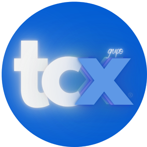

# Glossário de Comércio Exterior

| [A](#a) | [B](#b) | [C](#c) | [D](#d) | [E](#e) | [F](#f) | [G](#g) | [H](#h) | [I](#i) | [J](#j) | [K](#k) | [L](#l) | [M](#m) | [N](#n) | [O](#o) | [P](#p) | [Q](#q) | [R](#r) | [S](#s) | [T](#t) | [U](#u) | [V](#v) | [W](#w) | [X](#x) | [Y](#y) | [Z](#z) |

_(Esta é a versão resumida)_

*Para obter a versão extendida, visite a: ____.*

_Solicite também em PDF._

## A

ABANDONMENT TO INSURES = modalidade de regulamentação de danos, pela qual, nos casos excepcionais determinados pela política, o segurado cede aos seguradores todos os direitos sobre o que resta deste, contra pagamento da indenização prevista no contrato para o caso de perda total

ABEYANCE = suspenso, espera, pendência; IN ABEYANCE = pendente, em pendência

AC = Ato Concessório de Drawback 

ACC = Adiantamento sobre Contrato de Câmbio (ACC) trata-se de financiamento na fase de produção ou pré-embarque. Para realizar um ACC, o exportador deve procurar um banco comercial autorizado a operar em câmbio. Pode ser realizado até 360 dias antes do embarque da mercadoria. A liquidação da operação se dá com o recebimento do pagamento efetuado pelo importador, acompanhado do pagamento dos juros devidos pelo exportador, ou pode ser feita com encadeamento com um financiamento pós-embarque (ACE, PROEX, etc.). 

ACCELERATION CLAUSE = cláusula de aceleração (empregada frequentemente nos Estados Unidos para os contratos que prevêem pagamentos parceladas. Estabelece que a totalidade do saldo pendente será exigida quando qualquer um dos vencimentos deixe de ser observado pelo devedor, e também em caso de interrupção dos pagamentos (etc.)

ACC indireto = Trata-se de um mecanismo que permite ao exportador indireto financiar sua produção exportável com linhas de crédito externas. Podem se utilizar do ACC indireto os fabricantes de insumos que integrem o processo produtivo, o de montagem e o de embalagem de mercadorias destinadas à exportação, bem como os fabricantes de bens exportados por tradings. A empresa que vai exportar o produto final deve declarar que os produtos serão exportados.O financiamento pode ser contratado em dólares ou em reais. Obedece aos mesmos prazos do ACC. 

ACC = O ACC é um dos mais conhecidos e utilizados mecanismos de financiamento à exportação. Trata-se de financiamento na fase de produção ou pré-embarque.

ACCOMODATION ENDORSEMENTE = endosso de favor

ACCOMODATION NOTE = letra de favor, “papagaio”

ACCOUNT CURRENT = conta corrente, extrato de conta

ACCRUAL BASIS = competência do exercício. Método contábil geralmente usado para fins de imposto de renda, segundo o qual as receitas e despesas são apropriadas nos períodos específicos a que se referem

ACD = Apresentação da Carga para Despacho. A apresentação da carga para despacho (ACD) marca o início do procedimento fiscal e o fim da espontaneidade para o declarante ou o exportador retificar ou cancelar a DU-E sem que a retificação ou o cancelamento tenha que ser autorizado pela fiscalização aduaneira, com base na Instrução Normativa RFB n° 1.702, de 2017. 

ACE = Adiantamento sobre cambiais entregues  é um mecanismo similar ao ACC, só que contratado na fase de comercialização ou pós-embarque.

ACE = O ACE – Adiantamento sobre cambiais entregues é um mecanismo similar ao ACC, só que contratado na fase de comercialização ou pós-embarque. Após o embarque dos bens, o exportador entrega os documentos da exportação e as cambiais (saques) da operação ao banco e celebra um contrato de câmbio para liquidação futura. O ACE pode ser contratado com prazo de até 390 dias após o embarque da mercadoria. A liquidação da operação se dá com o recebimento do pagamento efetuado pelo importador, acompanhado do pagamento dos juros devidos pelo exportador. 

ACNOWLEDGEMENT TO RECEIPT = aviso de recebimento

ADJUSTMENT BOND = são “income bonds” utilizados na reorganização empresarial de sociedades. (“income bonds” são títulos vinculados ao lucro líquido de uma sociedade anônima)

Admissão temporária = Regime aduaneiro especial que permite a importação de bens que devam permanecer no País durante prazo fixado com suspensão total, ou parcial, de tributos. 

ADVANCE PAYMENT = pagamento antecipado

ADVERTISING = propaganda, publicidade (como um todo)

ADVICE OF CANCELLATION = aviso de cancelamento

ADVISING COMMISSION = comissão de aviso

AFFORD = (com CAN ou MAY) ter os meios ou recursos para; poder fazer; poder permitir-se; (com CAN ou BE ABLE) poder custear; poder fazer face a; produzir; fornecer; dar; proporcionar; oferecer; propor AFORO = capacidade; em determinados países da América di Sul, é o valor fixado pelo governo para as mercadorias sujeitas a imposto de importação 

AFTER DATE = após a data (essa expressão, aposta a um artigo, significa que este é pagável certo número de dias após sua data de fabricação. O vencimento assim fixado não depende, portanto, da data do aceite)

AGREEMENT = acordo, concordância, autorização, consentimento, contrato

AIR FREIGHT = frete aéreo

AIRMAIL = (por) via aérea

AIRMAIL TRANSFER = transferência de fundos pelo correio aéreo

AIR SONSIGNMENT NOTE = letra de transporte aéreo

AIRWAY BILL = conhecimento aéreo 

ALADI = A Associação Latino-Americana de Integração – ALADI foi instituída pelo Tratado de Montevidéu, em 12.08.80, incorporado ao ordenamento jurídico nacional pelo Decreto-Legislativo nº 66, de 16/11/1981, para dar continuidade ao processo de integração econômica iniciado em 1960 pela Associação Latino-Americana de Livre Comércio – ALALC. Este processo visa à implantação, de forma gradual e progressiva, de um mercado comum latino-americano, caracterizado principalmente pela adoção de preferências tarifárias e pela eliminação de restrições não-tarifárias. 

ALADI = A Associação Latino-Americana de Integração – ALADI foi instituída pelo Tratado de Montevidéu, em 12/08/80, para promover a expansão da integração na região, a fim de assegurar seu desenvolvimento econômico e social, tendo como objetivo final o estabelecimento de um mercado comum.

ALL RISKS = todos os riscos. Tipo de seguro garantindo perdas físicas ou danos decorrentes de qualquer causa externa, independentemente do percentual da perda e/ou dano, porém, exclui riscos de guerra, greves, motins, apresamentos, detenções e outros riscos, excluídos pelas garantias F.C. & S. (Livre de Captura e Apresamento) e S.R. & C.C. (greves, motins, e guerras civis) salvo se especificamente citadas na apólice

Anexação Eletrônica de Documentos = O módulo Anexação Eletrônica de Documentos, acessível por meio do sistema Visão Integrada no site Portal Siscomex, permite ao importador/exportador e seus representantes legais perante o Siscomex apresentar aos órgãos intervenientes no comércio exterior documentos de forma digitalizada. Com seu uso é possível reduzir: a necessidade do uso do papel e da protocolização presencial, os custos com o envio físico de documentos e o tempo para a efetivação de sua entrega. Ademais, é possível, por meio do módulo, eliminar a entrega múltipla do mesmo documento em razão da exigência de vários órgãos, visto que o operador privado de comércio exterior pode compartilhá-lo eletronicamente para os órgãos intervenientes que desejar. 

Antidumping = Considera-se prática de dumping a introdução de um bem no mercado doméstico, inclusive sob as modalidades de drawback, a preço de exportação inferior ao valor normal. O direito antidumping consiste em um montante igual ou inferior à margem de dumping apurada, cobrado com o fim exclusivo de neutralizar os efeitos danosos das importações objeto de dumping. O direito antidumping pode ser calculado mediante a aplicação de alíquotas ad valorem ou específicas, fixas ou variáveis, ou pela conjugação de ambas. No caso da alíquota ad valorem, ela é aplicada sobre o valor aduaneiro da mercadoria.

ARBITRATION AWARD = decisão arbitrária

ATA Carnet = Consiste em uma espécie de “passaporte de mercadorias”, um documento aduaneiro internacional, que possibilita exportar e importar bens temporariamente sem a incidência de impostos, de modo mais simples e ágil que o tradicional. A circulação destas mercadorias poderá ocorrer nos países que utilizam o ATA Carnet por um período de até 12 meses.

AUTHORITY TO NEGOTIATE ou PURCHASE = fórmula de crédito documentária utilizada principalmente no Extremo Oriente e que se aproxima gradualmente do crédito documentário clássico. Em princípio essa autoridade (autorização) prevê entre outros documentos, um saque sobre o comprador

AUTHORITY TO PAY = modalidade especial de crédito documentário geralmente revogável, utilizado principalmente pelos bancos ingleses em suas relações com o Extremo Oriente e pelos bancos americanos

<a class="voltar" href="#inicio">Voltar ao topo</a>

## B

Back to back = A operação de back to back caracteriza-se pela operação de compra e venda de produtos estrangeiros, realizada no exterior por empresa estabelecida no Brasil, sem que a mercadoria transite fisicamente pelo território brasileiro. Assim, não são emitidos documentos de importação ou de exportação. Para obter informações sobre as questões cambiais envolvidas, consulte a legislação do Banco Central. 

BACK TO BACK CREDIT = crédito documentário vinculado a um primeiro crédito denominado “crédit maítre”. O beneficiário do primeiro crédito é geralmente um intermediário que cede sua vez ao segundo crédito a favor do fornecedor da mercadoria

BACK TO BACK = operação financeira com cliente, para capital de giro, realizada por banco nacional, mediante garantia pelo financiador no exterior e formalizada através de depósito em moeda estrangeira junto a um correspondente. As divisas não saem do exterior.

Balança Comercial = Demonstração dos valores da exportações e importações de um país.

BALANCE SHEET = balanço geral, balancete

BALE = fardo

BALLAST = lastro

BAND = braçadeira

BANKARUPTCY = falência, quebra, bancarrota, insolvência

BANK = banco, casa bancária

BANK (BANKER’S) ACCEPTANCE = aceite bancário. Título aceito por banco para colocação no mercado de descontos. A Carteira de Câmbio possui uma modalidade de financiamento para importação em que se utiliza o aceite por parte de nossas agências de New York, Londres, Hamburgo, Paris e Panamá. A importação amparada em carta de crédito, é paga à vista, mas financiada ao importador, que emite letras de câmbio a 180 dias, as quais são aceitas por aquelas agências (bank acceptance), conforme a praça, para desconto no mercado de títulos

Barreira Comercial – Embora não haja uma definição precisa para Barreira Comercial, esta pode ser entendida como qualquer lei, regulamento, política, medida ou prática governamental que imponha restrições ao comércio exterior. Há duas categorias mais comuns de barreiras = Barreiras tarifárias e Barreiras não-tarifárias.

Barreiras não tarifárias = São consideradas barreiras não-tarifárias as medidas e os instrumentos de política econômica que afetam o comércio entre dois ou mais países e que dispensam o uso de mecanismos tarifários (tarifas ad-valorem ou específicas).

Barreira Tarifária = Imposição de tributos aduaneiros sobre produtos transacionados. 

BIAS = erro sistemático (estatística), orientação tendenciosa, preconceito

BILL = fatura, conta, letra, certificado, obrigação, bilhete, escritura, título, nota, saque

BILLING = faturamento

BILL OF LADING = conhecimento de embarque. É ao mesmo tempo um recibo de mercadorias, um contrato de entrega e um documento de propriedade

BLANK CHECK = cheque em branco

BRAZILIAN FLAG VESSEL = navio de bandeira brasileira

BREAKINK BULK = abertura do porão de um navio e início da descarga

BUSINESS DAY = dia útil

<a class="voltar" href="#inicio">Voltar ao topo</a>

## C

CABLE TRANSFER = transferência por telegrama

CALL = escala, parada (de navio); opção ou oferta transferível de venda de ações; chamada de capital, operação a termo - ON CALL = resgatável ou exigível sem aviso prévio (diz-se de dívida, título etc.)

Câmaras de Comércio = Sociedades civis, sem fim lucrativo, constituídas com o aval oficial do país que representam. Visam a estimular o comércio bilateral. Normalmente são fundadas por empresários interessados em expandir o comércio com um determinado país e têm como associados pessoas físicas e jurídicas em ambos os países. 

CAPITAL MARKET = mercado de capital, onde se negociam investimentos e fundos a longo prazo

CAPITAL TURNOVER = movimento de capital

CAPTA = Sistema de Consultas sobre Tarifas, Regras de Origem e Serviços dos Acordos Comerciais Brasileiros. O sistema CAPTA está em fase de atualização. 

CARRYING VESSEL = navio transportador

Carta de Crédito = Modalidade de pagamento mais difundida no comércio internacional, pois oferece maiores garantias, tanto para o exportador como para o importador. É um instrumento emitido por um banco (o banco emitente), a pedido de um cliente (o tomador do crédito). De conformidade com instruções deste, o banco compromete-se a efetuar um pagamento a um terceiro (o beneficiário), contra entrega de documentos estipulados, desde que os termos e condições do crédito sejam cumpridos. 

CARTAGE = transporte (por caminhão ou carroça); carreto

CASH LETTER = formulário de depósito para encaminhamento de quaisquer documentos cujos pagamentos se processem à vista (cheques bancários, “International Money Orders-IMO”, etc.), desde que tais papéis estejam desacompanhados de instruções especiais

CASH VOUCHER = comprovante de caixa

CATALOG = catálogo

CCE = Carga Completamente Exportada 

CCT = Controle de Carga e Trânsito 

CEILING PRICE = preço-teto (admitido pelas autoridades de um país para determinada mercadoria)

Certificação Halal = A Certificação Halal consiste em um processo pelo qual uma agência controlada pelo governo e/ou uma organização islâmica reconhecida certifica a aptidão da indústria em praticar os procedimentos Halal, produzir, armazenar e comercializar produtos destinados aos consumidores muçulmanos.

Certificações = Certificações consiste em atestar publicamente, por escrito, que determinado produto, processo ou serviço está em conformidade com determinados requisitos. Resumidamente, existem certificações compulsórias e voluntárias.

Certificado de origem = O Certificado de Origem é o documento necessário para que as mercadorias se beneficiem do tratamento tarifário preferencial. Para tanto, deve ser emitido em conformidade com as regras prescritas por cada Acordo. 

Certificado de origem preferencial = O Certificado de Origem é o documento que identifica a origem de determinado bem para efeitos de concessão de tratamento tarifário preferencial contratual ou autônomo. Para tanto, o certificado de origem deve ser emitido em conformidade com as regras prescritas por cada Acordo ou legislação pertinente. 

CERTIFICATE = certificado, certidão, atestado, testemunho

CERTIFICATE OF CONDITIONING = certificado emitido por um a autoridade oficial, constatando e certificando o peso líquido de lã ou seda, sob a base de um grau de umidade

CERTIFICATE OF DAMAGE = certificado de avaria

CERTIFICATE OF DEPOSIT = certificado de depósito, “warrant”

CERTIFICATE OF MANUFACTURE = certificado emitido por um fabricante, confirmando que a mercadoria foi fabricada e se encontra a disposição dos compradores

CERTIFICATE OF ORIGIN = certificado de origem

CERTIFICATE OF SHIPMENT = certificado emitido por uma companhia de navegação, comprovando que um determinado lote de mercadoria foi embarcado

CERTIFICATE OF WEIGHT = certificado de peso

CERTIFICAT OF REGISTRY = certificado de registro

CFOP = Código Fiscal de Operações e Prestações 

CFR = Cost and Freight - Custo e Frete. As despesas decorrentes da colocação da mercadoria a bordo do navio, o frete até o porto de destino designado e as formalidades de exportação correm por conta do vendedor. Os riscos e danos da mercadoria, a partir do momento em que é colocada a bordo do navio, no porto de embarque, são de responsabilidade do comprador, que deverá contratar e pagar o seguro e os gastos com o desembarque. ver INCOTERMS.

CHAMBER OF COMMERCE = câmara de comércio

CHANGE = câmbio, troca 

CHARGE IN EXCESS (TO) = cobrar em excesso

CHARGES FORWARD = expressão bancária inglesa significando que as comissões bancárias, juros, despesas e taxas decorrentes de embalagem de um artigo no estrangeiro são por conta do sacado

CHARTER = documento de formação de uma companhia; contrato de afretamento; carta-patente

CHARTERER = afretador

CHARTER-PARTY = sistema de carta de afretamento ou carta-partida, caracterizado pelos contratos de fretamentos sob os quais sempre operam os navios öut-siders”, ou seja, aqueles sem roteiro pré-determinado e com fretes convencionados para cada viagem

CHART OF ACCOUNTS = plano de contas

CHATTEL MORTGAGE = penhor no qual os bens empenhados permanecem poder do devedor (exemplo: penhor agrícola e penhor industrial)

CHEAP = barato

CHECK (TO) = conferir, verificar, examinar, checar

CIDE-Combustíveis: Essa Contribuição de Intervenção no Domínio Econômico (CIDE) é um tributo de competência federal que possui caráter regulatório, para ajuste dos preços dos combustíveis. A CIDE-Combustíveis incide sobre a importação e comercialização de derivados de petróleo. A CIDE-Combustíveis também atende ao princípio da não-cumulatividade. Assim, o valor pago no momento da importação é creditado pelo importador para compensação com as contribuições devidas em operações posteriores que ele realizar com as mercadorias. A base de cálculo da Cide-Combustíveis é a quantidade comercializada do produto expressa nas unidades de medida constantes dos Anexos I e II da Instrução Normativa SRF no 422/04. A contribuição é calculada pela aplicação das alíquotas fixadas no artigo 10 dessa mesma IN sobre a base de cálculo. Assim, a contribuição devida é igual a: CIDE-Combustíveis = Alíquota CIDE x Qde. Prod. 

CIF = Cost, Insurance and Freight - Custo, Seguro e Frete. Cláusula universalmente utilizada em que todas despesas, inclusive seguro marítimo e frete, até a chegada da mercadoria no porto de destino designado correm por conta do vendedor. Todos os riscos, desde o momento que transpõe a amurada do navio, no porto de embarque, são de responsabilidade do comprador. O comprador recebe a mercadoria no porto de destino e arca com todas despesas, tais como desembarque, impostos, taxas e direitos aduaneiros. ver INCOTERMS.

CIP = Carriage and Insurance Paid to - Transporte e Seguro Pagos até. O frete é pago pelo vendedor até o destino convencionado. As responsabilidades são as mesmas indicadas na CPT, acrescidas do pagamento de seguro até o destino. Os riscos e danos passam para a responsabilidade do comprador no momento em que o transportador assume a custódia das mercadorias. ver INCOTERMS.

CLAIM AN INDEMNITY (TO) = reclamar uma indenização

CLAIMANT = reclamante

Classificação de Mercadorias = Classificar uma mercadoria significa determinar uma correlação entre ela e um código especificado na Nomenclatura de Mercadorias.

CLEAN BILL OF LADING = conhecimento marítimo limpo (sem rasuras correções e cláusulas adicionais)

CLEAN CREDIT = crédito realizável sem apresentação de documentos

CLEAN LETTER OF CREDIT = carta de crédito utilizável sem apresentação de documentos de embarque

CLOSE CORPORATION = sociedade anônima de capital fechado

COAST = costa

COASTING = cabotagem

Cofins Importação: A Cofins-Importação e o PIS-Importação são contribuições sociais de competência federal para financiamento da seguridade social, incidentes sobre a importação de produtos estrangeiros. Essas contribuições dão tratamento tributário isonômico entre os bens produzidos no País, que sofrem a incidência dessas contribuições, e os bens importados, que são tributados às mesmas alíquotas dos bens nacionais. Tais contribuições sociais atendem também ao princípio da não-cumulatividade e, assim, os valores pagos no momento da importação podem ser creditados pelo importador para posterior compensação com as contribuições por ele devidas. Na quase totalidade das importações, a alíquota aplicável do PIS é de 1,65% e a da Cofins é de 7,6%. A base de cálculo para ambas as contribuições é o valor aduaneiro das mercadorias importadas, acrescido do valor do Imposto sobre Circulação de Mercadorias e Prestação de Serviços (ICMS), incidente sobre a importação, e do valor das próprias contribuições, pois elas são incluídas no preço final das mercadorias (cálculo “por dentro”). Assim as contribuições devidas são iguais a: PIS = Alíquota PIS x (VA + ICMS + PIS + Cofins) Cofins = Alíquota Cofins x (VA + ICMS + PIS + Cofins). Também é possível efetuar os cálculos dessas contribuições sociais a partir das fórmulas constantes da Instrução Normativa SRF n° 572/05. 

COLLECTION BASIS = à base de cobrança

COLLECTION = cobrança

COLLECT SHIPMENT = embarque a cobrar

COMBINED BILL OF LADING = conhecimento relativo a mercadorias para cuja entrega são utilizados vários tipos de transporte

COMBINED INVOICE = nota fiscal

COMBINED TRANSPORT DOCUMENT = documento de transporte conectado.  Documento relativo a mercadorias, para cuja entrega são utilizadas vários tipos de transporte

Comercial Exportadora = Empresa que  adquire mercadorias de terceiros e exporta em nome próprio.

Comércio Eletrônico = Realização de negócios de compra e venda de bens e serviços com a utilização da Internet.

Comex Responde = É um serviço de informação virtual do Governo Federal que atende consultas e dúvidas relativas ao comércio exterior. O Comex Responde conta com uma equipe de técnicos especializados para atender de forma eficiente e eficaz os interessados no tema. Disponível nos idiomas português, inglês, francês e espanhol atende também o público externo interessado em negociar com as empresas brasileiras. O Comex Responde foi estabelecido por meio da Resolução CAMEX nº 78, de 2 de outubro de 2013. Trata-se de serviço de solução de dúvidas que tem por finalidade atender pedidos de informação relativos aos seguintes assuntos pertinentes ao comércio exterior: I - legislação, exigências, documentos, e procedimentos operacionais e técnicos relativos às operações de importação e exportação; II - acordos internacionais; III - nomenclaturas; IV - logística; V - estatísticas; VI - tributos; VII – crédito, financiamento e apoio à exportação; VIII – promoção comercial e IX - oportunidades de negócios. A prestação de informações por meio do Comex Responde é gratuita e realizada através do preenchimento de formulário eletrônico. Os órgãos e entidades da Administração Pública Federal com atribuições relacionadas ao comércio exterior são responsáveis por fornecer as respostas relativas aos assuntos de suas competências. Os prazos para as respostas atendem ao disposto no art. 11 da Lei nº 12.527, de 18 de novembro de 2011. Não são objeto de resposta pelo Comex Responde as solicitações de providências e consultas relativas a processos e requerimentos individuais. As informações prestadas por meio do Comex Responde não substituem a legislação pertinente. 

COMMERCE = comércio

COMMERCIAL INVOICE = fatura comercial

COMMINTE FEE = comissão de compromisso

COMMODITY = coisa de utilidade, especialmente artigos comerciáveis

COMMON CARRIER BILL OF LADING = conhecimento de transportador público que explora linha regular

COMPANY = companhia, empresa

COMPETITIVE PRICE = preço competitivo, preço de livre concorrência

COMPLAINT = queixa

COMPLETE (TO) = completar 

COMPOUND INTEREST = juros compostos

COMPROMISE = compromisso, acordo, concessão mútua

COMPTROLLER = superintendente, fiscal, inspetor, controlador

COMPULSORY LOAN = empréstimo compulsório

COMPUND DISCOUNT = desconto composto

COMSUMPTION = consumo

CONCERNED PARTY = parte interessada

CONCERN = empresa, firma, estabelecimento

CONCESSION = concessão

CONFERENCE LINE FREIGHT TERMS = condições uniformes de frete adotadas pelas embarcações pertencentes a uma “Conferência”

CONFERENCE LINE VESSEL = embarcação pertencente a uma companhia que faz parte de uma “conferência”

CONFIRMED PRICES = preços confirmados

CONSIGNEE = consignatário; destinatário; agente

CONSIGNMENT = consignação 

CONSIGNMENT NOTE = nota de entrega, nota de consignação

CONSIGNOR (CONSIGNER) = consignante, consignador; aquele que envia a coisa consignada

CONSULAR INVOICE = fatura consular

CONSULAR VISA = visto consular

CONSUMPTION GOODS = bens de consumo

CONTAINER = cofre de carga; recipiente, vasilha; equipamento internacional padronizado para o transporte de mercadorias composto de módulos retangulares, com altura e largura de 8 pés e comprimentos que variam entre 5,10, 20, 30 e 40 pés, apresentando como principais vantagens a inviolabilidade, redução de 10% no frete marítimo e taxas especiais para o transporte rodo-ferroviário, prêmios de seguros menores e livre trânsito em todo o território nacional

Contêiner = O contêiner (do inglês container ) ou contenedor consiste em um recipiente (cofre de carga) que tem a finalidade de possibilitar o transporte em segurança de mercadorias de natureza variada, de modo inviolável e rápido. 

CONTENTS = conteúdo; índice

CONTINGENCIES = contingências

CONTRACT FOR DELIVERY = contrato de entrega. É uma das três funções de um B/L

CONTRACT OF CARRIAGE = contrato de transporte (de mercadoria p.ex.)

CONTRIBUTED CAPITAL = capital integralizado

COPNFIRMATION LETTER = carta de confirmação

COPYRIGHT = direitos reservados (sobre obras literárias); direito autoral

CORPORATION = corporação, companhia, reunião de duas ou mais pessoas reconhecida por lei como uma só sociedade; sociedade anônima

CORRECT (TO) = corrigir

Corrente de Comércio = Soma das exportações e importações.

COST AND FREIGHT CLEARED = nesse caso, as despesas com certificado consular, impostos consulares e o custo de todos os outros documentos necessários para a importação ao país de destino (ou para sua passagem em trânsito num terceiro país), expedidos no país de embarque ou de origem e todos os demais direitos e impostos necessários para a importação, são por conta do vendedor

COST AND FREIGHT = custo e frete; a esta expressão segue-se o nome do porto de destino; significa que o preço inclui a mercadoria posta no porto de destino, sem a cobertura de seguro

COST AND FREIGHT CUSTOMS DUTIES PAID = custo e frete, direitos alfandegários pagos. Os direitos alfandegários no porto de destino são por conta do vendedor, podendo os outros impostos e despesas da importação ficar por conta do comprador

COST AND FREIGHT LANDED = expressão que significa estarem as despesas de descarga - compreendidas alvarengagem e colocação no cais - a cargo do vendedor

COST, INSURANCE AND FREIGHT = custo, seguro e frete. Esta expressão vem seguida do nome do porto de destino. É usada na cotação dos preços. Significa que o preços. Significa que o preço se estende pela mercadoria posta no porto de destino, frete pago e coberto pelo seguro

COST, INSURANCE AND FREIGHT FREE OUT = modalidade da cláusula CIF.  Significa que o preço inclui o frete e o seguro, mas não os custos com a descarga no destino. Entretanto, é necessário assinalar que o montante das despesas com a descarga varia segundo a companhia

COST, INSURANCE, FREIGHT AND EXCHANGE = custo, seguro, frete e câmbio.  Modalidade da cláusula CIF. Significa que o preço cobrado pelo exportador inclui (além do preço da mercadoria, do seguro e do frete) as despesas que podem decorrer do câmbio e da negociação da respectiva letra; estas despesas não podem ser faturadas como extras

COST OF LIVING = custo de vida

COST PRICE = preço de custo

Cota ALADI = Alguns Acordos no âmbito da ALADI (Associação Latino-Americana de Integração) estabelecem que determinadas mercadorias podem ser importadas usufruindo de redução tarifária, desde que tais importações ocorram até a quantidade máxima de mercadoria definida no Acordo e num determinado período de tempo. As importações dessas mercadorias, até o limite da cota, sofrerão um desconto no Imposto de Importação (II), representado por uma Margem de Preferência (MP). A redução tarifária somente é obtida pelas operações com Licença de Importação deferida especificamente para este fim. Para tal, além do controle da cota, também é feito o controle da Origem da mercadoria, que ocorre via análise do Certificado de Origem apresentado pelo importador. Com o fim da cota, as importações dessa mercadoria voltam a pagar a alíquota normal do II. 

Cota de abastecimento = A Cota de Abastecimento é uma quantidade de mercadorias que pode ingressar no país, usufruindo de redução tarifária, em períodos em que a produção do país seja insuficiente para o atendimento das necessidades internas, ou quando houver um surto de demanda. Nessas ocasiões, a CAMEX, com base na Resolução GMC nº 08/08, pode determinar uma redução no Imposto de Importação, acompanhada de limites quantitativos e prazos de vigência. Nessa categoria também podem se enquadrar algumas reduções tarifárias publicadas pela CAMEX com base em Decisão do CMC. O Anexo III da Portaria nº 23, de 14 de julho de 2011 apresenta a relação dos produtos contemplados com Cota de Abastecimento. 

Cotas tarifárias = Os acordos comerciais que preveem a concessão de preferências tarifárias mútuas para o comércio entre os parceiros podem também estipular que a preferência será concedida apenas até um determinado volume de produto importado. Ao estabelecer uma quota, o país procura evitar que uma súbita elevação da importação de determinado produto provoque um efeito indesejado em sua economia, principalmente em setores mais sensíveis. Há também situações em que um país opte por conceder benefícios unilaterais a países de menor desenvolvimento relativo, como forma de promover suas importações daquela origem. 

COUNTERFEIT = contrafação, falsificação, dissimulação, fingimento

COUNTER-OFFER = contra-oferta

COUNTER-PROPOSAL = contra-proposta

COUNTERSIGN = assinatura com que se autentica uma outra, contra-assinatura

COUNTERSIGN (TO) = contra-assinar, rubricar

COUNTERVALUE = contravalor

COUNTER-WEIGHT = contra-peso

COUNTRY OF ORIGIN = país de origem 

COUNTRY TRADE = comércio interior

CPT = Carriage Paid To - Transporte Pago Até. O vendedor paga o frete até o local do destino indicado. O comprador assume o ônus dos riscos por perdas e danos, a partir do momento em que a transportadora assume a custódia das mercadorias. ver INCOTERMS.

CREDIT ADVICE = aviso de crédito

CREDIT AMOUNT = valor do crédito

CREDIT BALANCE = saldo credor

CREDIT LINE = linha de crédito

CREDITOR = credor

CREW = tripulação

CROSS RATE = taxas cruzadas. Cotações nas bolsas de Nova Iorque e/ou Londres.  Servem como fator de multiplicação que aplicado à taxa-base (dólar americano), dá o equivalente em moeda nacional

CT-e = Conhecimento de Transporte Eletrônico de Cargas.

CURRENCY = moeda corrente

CURRENCY RATE = taxa de câmbio de uma moeda, divisa

CURRENT ACCOUNT = conta corrente

CURRENT LIABILITY = exigível a curto prazo, passivo corrente

CURRENT PRICE = preço atual, preço corrente

CUSTODY BILL OF LADING = conhecimento emitido por um entreposto americano

CUSTOM FEE = taxa alfandegária

CUSTOM INVOICE = fatura aduaneira

CUSTOMS = alfândega, aduana

CUSTOMS BROKER = despachante aduaneiro

CUSTOMS CLEARANCE = desembaraço aduaneiro ou alfandegário

CUSTOMS DUTIES = direitos aduaneiros ou alfandegários

CUSTOMS ENTRY FORM = formulário de declaração à alfândega

CUSTOMS HOUSE = alfândega, aduana

CUSTOMS OFFICER = inspetor da alfândega

CUSTOMS OFFICIAL = oficial (funcionário) da alfândega

CUSTOMS TARIFF = tarifa alfandegária

CUT PRICE = preço reduzido

CYCLE = ciclo, componente cíclico

<a class="voltar" href="#inicio">Voltar ao topo</a>

## D

DAF = Delivered At Frontier - Entregue na Fonteira. A entrega da mercadoria é feita em um ponto antes da fronteira alfandegária com o país limítrofe. A partir desse ponto a responsabilidade por despesas, perdas e danos é do comprador. ver INCOTERMS.

DAMAGE AND COST = danos e prejuízos

DAMAGED BY FIRE = danificado pelo fogo

DAMAGED BY FRESH WATER = avariado por água doce

DAMAGED BY SEA WATER = avariado por água salgada

DAMAGED BY SWEAT IN THE HOLD = avariado pela umidade do porão

DAMAGED = danificado, avariado

DAMAGED THROUGH STRESS WEATHER = avariado pelo mau tempo

DAMAGED TROUGH BAD WEATHER = avariado pelo mau tempo

DAMAGE = estrago, dano, avaria, prejuízo, perda, indenização por avaria

DAT = Documento de Acompanhamento de Trânsito.

DATE = data

DBN = O DBN é um desdobramento da Nomenclatura Comum do Mercosul (NCM), para fins estatísticos e de tratamento administrativo de comércio exterior, exclusivamente de uso no Brasil. O desenvolvimento e a administração do DBN estão a cargo do Grupo Técnico de Gestão do Detalhamento Brasileiro de Nomenclatura (GDBN), criado pela Resolução CAMEX nº 36/ 2013, no âmbito do Comitê Executivo de Gestão (Gecex) da Câmara de Comércio Exterior (Camex). O Grupo é responsável por definir os procedimentos para recebimento de pleitos do setor privado, gerenciar e avaliar a manutenção e inclusão de códigos, e propor as alterações normativas pertinentes. O objetivo é a criação de quatro dígitos numéricos adicionais de detalhamento da nomenclatura, em campo específico, que permitirá a alocação de códigos em separado para cada produto que necessite de tratamento diferenciado.

DDP = Delivered Duty Paid - Entregue Direitos Pagos. O vendedor cumpre os termos de negociação ao tornar a mercadoria disponível no país do importador, no local combinado. O vendedor assume os riscos e custos referentes a impostos e outros encargos até a entrega da mercadoria. Este termo representa o máximo de obrigação do vendedor em contraposição ao EXW.  ver INCOTERMS.

DDU = Delivered Duty Unpaid - Entregues Direitos Não-pagos. Consiste na entrega de mercadorias dentro do país do comprador, descarregadas. Os riscos e as despesas até a entrega da mercadoria correm por conta do vendedor, exceto as decorrentes do pagamento de direitos, impostos e outros encargos decorrentes da importação. ver INCOTERMS.

DEADFREIGHT = montante de frete a pagar por tonelada reservada, porém não utilizada, quando a mercadoria não for transportada

DEAL = negócio, transação, trato, acordo - A GRAT DEAL = muito, grande quantidade - IT’S A DEAL = negócio fechado - DEAL IN (TO) = negociar, comerciar em

DEAL OUT (TO) = dispensar

DEBIT ADVICE = aviso de débito

DEBIT BALANCE = saldo devedor

DEBIT = débito, dívida

DEBT = débito, dívida, obrigação, responsabilidade

DECK CARGO = carga sobre o convés

DECK = convés

DECREASE = dedução, diminuição

DE / DI = Declaração de Exportação.

DEED = escritura

DEFAULT = falta, falha, ausência, omissão, descuido, negligência, inadimplemento de cláusula contratual (quanto a pagamento)

DELIVERY AGAINST PAYMENT = entrega contra pagamento

DELIVERY NOTE = nota de entrega (nota fiscal)

DEMAND DEPOSIT = depósito em conta corrente, depósito à vista

DEMAND = procura, demanda, pretenção, exigência ON DEMAND = à vista, contra entrega

DEMURRAGE = indenização por detenção do navio (no porto); sobre estadia

DENIAL = negação, negativa, recusa, rejeição

DEPARTMENT = departamento, seção

DEPARTURE = partida, saída

DEPOSIT = depósito, caução, vinculação

DEPOSIT (ON ACCOUNT OF PURCHASE) = sinal (por conta de compra)

DEPOSIT (TO) = depositar, caucionar, vincular

DEPRECIATION = depreciação, desvalorização

DEPRESSION = depressão, crise

DEPUTY = representante, delegado, substituto, adjunto, auxiliar, agente, vice, interino

DEQ = Delivered Ex-Quay - Entregue no Cais. O vendedor entrega a mercadoria desembaraçada ao comprador, no porto de destino designado. A responsabilidade pelas despesas e também pelos riscos e perdas até a entrega é do vendedor. ver INCOTERMS.

DERIVE FROM (TO) = provir de, derivar, colher, originar-se de

Desconto de cambiais no exterior = O exportador pode antecipar a receita da sua exportação vendendo o seu crédito (direitos sobre as cambiais aceitas pelo importador) para um agente de crédito no exterior. A operação pode ser com ou sem direito de regresso contra o exportador. Os juros da operação são isentos de IR na fonte.DrawbackRegime Aduaneiro Especial que objetiva desonerar de tributos os insumos utilizados na produção de bens destinados à exportação.

DESCRIPTION OF GOODS = descrição da mercadoria

DES = Delivered Ex-Ship - Entregue no Navio. O vendedor coloca a mercadoria, não desembaraçada, a bordo do navio, no porto de destino designado, à disposição do comprador. A Até chegar ao destino, a responsabilidade por perdas e danos é do vendedor. ver INCOTERMS.

DESTINATION = destino

DETAIL = detalhe

DETAILED CREDIT NOTE = nota de crédito detalhada

DETRAIN = desembarcar do trem

DEVALUATION = desvalorização, depreciação

DIRECT BILL OF LADING = conhecimento sem transbordo. Não confundir com o termo francês “connaissement direct” que corresponde a “trough bill ol lading”

DIRECT PURCHASING = compra direta do produtor, sem interferência de agente ou corretor

DIRECT SHIPMENT = embarque direto (do fabricante ou fornecedor, ao consumidor

DISCHARGE = descarregamento, desembarque; pagamento, quitação (de débito)

DISCOUNT RATE = taxa de desconto

DISEMBARK (TO) = desembarcar, descarregar

DISHONORED BILL = letra não paga, letra não aceita

DIVIDEND WARRANT = dividendo sob a forma de cheque que as sociedades anônimas anglo-saxônicas remetem a seus acionistas portadores de ações nominativas em pagamento de dividendo

DOCK = doca

DOCK RECEIPT = certificado emitido pelo chefe de um entreposto ou guarda-cais, atestando que as mercadorias foram recebidas pela companhia de navegação

DOCUMENTARY CREDIT = crédito documentário

DOMESTIC BRANCHES = Agências ou Filiais no País

DOOR TO DOOR = porta a porta; fórmula utilizada em operações comerciais de exportação, através da qual o importador exige, no respectivo contrato, a entrega da mercadoria em seus armazéns dentro dos prazos fixados

DOWN PAYMENT = sinal, pagamento inicial, entrada

Drawback integrado isenção = É aplicado na aquisição, no mercado interno ou na importação, de forma combinada ou não, de mercadoria equivalente à empregada ou consumida na industrialização de produto exportado. O regime aplica-se também à aquisição, no mercado interno ou na importação, de mercadoria equivalente à empregada em reparo, criação, cultivo ou atividade extrativista de produto já exportado. Trata-se, portanto, de uma reposição de estoque. O beneficiário do regime poderá optar pela importação ou pela aquisição no mercado interno da mercadoria equivalente, de forma combinada ou não, considerada a quantidade total adquirida ou importada com pagamento de tributos.

Drawback integrado suspensão = É aplicado na aquisição no mercado interno ou importação, de forma combinada ou não, de mercadoria para emprego ou consumo na industrialização de produto a ser exportado, com suspensão dos tributos exigíveis na importação e na aquisição no mercado interno. Aplica-se também à aquisição no mercado interno ou à importação de mercadorias para emprego em reparo, criação, cultivo ou atividade extrativista de produto a ser exportado.

Drawback = O Regime de Drawback é um estímulo (incentivo) às exportações com o objetivo de proporcionar melhores condições de competitividade do produto brasileiro no exterior. Compreende as modalidades de suspensão, isenção e restituição dos tributos incidentes na importação de mercadorias utilizadas na industrialização de produto exportado ou a exportar. O reembolso parcial de direitos alfandegários, ou imposto de determinadas mercadorias importadas, no momento de sua reexportação depois de sua transformação ou incorporação a outro produto. Em alguns casos também significa: desvantagem

Drawback para embarcação = Concedido na modalidade suspensão, na forma do inciso II do art. 82 da Portaria Secex nº 23/2011, de 14 de julho de 2011, e isenção. Caracteriza-se pela importação de mercadoria utilizada em processo de industrialização de embarcação, destinada ao mercado.

Drawback restituição = Esta modalidade refere-se à restituição, total ou parcial, dos tributos pagos na importação de mercadoria exportada após beneficiamento, ou utilizada na fabricação, complementação ou acondicionamento de outra exportada. O regime compreende a restituição do II, do IPI, do PIS/PASEP e da COFINS. Deve-se ressaltar que a restituição dos tributos é concedida sob a forma de Crédito Fiscal à Importação, no valor recolhido através da Declaração de Importação, a ser utilizado em qualquer importação posterior. A habilitação a esse crédito fiscal deve ser feita no prazo máximo de noventa dias da efetiva exportação da mercadoria, prazo este que pode ser prorrogado uma única vez por igual período. O benefício é concedido pela Receita Federal do Brasil.

DSE = Declaração Simplificada de Exportação.

DUE DATE = data do vencimento

DUE TO ARRIVE = programado para chegar

Duimp = Declaração Única de Importação.

Dumping = Considera-se que há prática de dumping quando uma empresa exporta para o Brasil um produto a preço (preço de exportação) inferior àquele que pratica para o produto similar nas vendas para o seu mercado interno (valor normal). Desta forma, a diferenciação de preços já é por si só considerada como prática desleal de comércio.

DUTY = direito a ser pago sobre mercadorias importadas ou exportadas; dever, obrigação, imposto

DUTY-FREE MERCHANDISE = mercadoria livre de direitos 

<a class="voltar" href="#inicio">Voltar ao topo</a>

## E

EARNINGS = ganhos, ordenado, salário, lucros, férias, receitas

EFD = Escrituração Fiscal Digital.

Encat = Encontro Nacional de Coordenadores e Administradores Tributários Estaduais.

Enquadramento da operação = Código que identifica um tipo de operação, podendo ser com ou sem expectativa de recebimento, com ou sem retorno. Por definição, quando o código começa com “8” há expectativa de recebimento de divisas e quando começa com “9” não há expectativa de recebimento de divisas. Se for 9 seguido de zero, é exportação temporária e se for 9 seguido de outro 9, é exportação definitiva.

EUROBONDS = euro-obrigações

EUROCLEAR = sistema de compensação internacional para transações de títulos, principalmente euro-obrigações 

EURODOLLARS = direitos em dólares de bancos não americanos que podem ser repassados a outros bancos ou instituições interessadas (comércio, indústria, entidades públicas e mistas) EUROPEAN COMMON MARKET = Mercado Comum Europeu

EUROPEAN FREE TRADE ASSOCIATION = Associação Européia de Livre Comércio

Exame de similaridade = As importações sujeitas a Exame de Similaridade são objeto de licenciamento não automático, previamente ao embarque dos bens no exterior. Estão sujeitas ao prévio exame de similaridade as importações na qual sejam pleiteados benefícios fiscais (isenção ou redução do imposto de importação), inclusive as realizadas pela União, pelos Estados, pelo Distrito Federal, pelos Municípios e pelas respectivas autarquias. O Regulamento Aduaneiro (Decreto no 6.759, de 05/02/09, e alterações), em seus artigos 136 a 189, apresenta os casos em que a legislação concede benefícios fiscais na importação, com observância dos termos, limites e condições estabelecidos no Regulamento.

EXCEEDS ARRANGEMENTS = fora dos limites (motivo de recusa de pagamento inscrito em cheques ou artigos devolvidos sem seu pagamento

EX-DOCK = na doca, no porto de importação designado. A esse termo segue-se o nome do porto de importação. Indica a cotação de uma mercadoria incluindo o seu custo e todas as despesas adicionais necessárias para colocar a mercadoria na doca, no porto de importação designado, com os direitos pagos. A partir daí as despesa ocorrerão por conta do comprador

EXEMPTION = isenção

EXEMPT PRIVATE COMPANY = variante de PRIVATE LIMITED COMPANY; tem o caráter de ser ainda mais fechada (familiar, em geral), sendo dispensada de fornecer balanços anuais e contas de lucros e perdas ao Departamento de Registro de Sociedades

EXHIBIT = documento, prova, anexo; demonstração

EXPENSES INCURRED = despesas ocorridas 

EXPENSES TO BE BORNE BY THE BENEFICIARY = despesas a serem pagas pelo beneficiário

EXPENSES TO BE BORNE BY THE BUYERS = despesas a serem pagas pelos compradores

EXPENSIVE = dispendioso, caro, custoso

EX-PIER = no molhe

EXPIRED CREDIT = crédito vencido

EXPIRE (TO) = expirar, vencer (prazo)

EXPIRY DATE = data do vencimento

EX-PLANTATION = na plantação

Exportação = Consiste na saída temporária ou definitiva em território nacional de bens ou serviços originários ou procedentes do país, a título oneroso ou gratuito. A exportação pode ser definida como a saída da mercadoria do território aduaneiro. Trata-se, portanto, da saída de um bem do Brasil, que pode ocorrer em virtude de um contrato internacional de compra e venda.Exportação em consignaçãoConsiste em permissão para envio de mercadoria ao exterior, a um consignatário nomeado, na expectativa de venda futura e posterior liquidação do câmbio correspondente. Todos os produtos da pauta de exportação brasileira são passíveis de venda em consignação. Após a venda, o exportador deverá regularizar a saída com a emissão de nova DU-E, conforme artigo 102, inciso V da IN RFB 1702/17.

Exportação em consignação = Consiste em permissão para envio de mercadoria ao exterior, a um consignatário nomeado, na expectativa de venda futura e posterior liquidação do câmbio correspondente. Todos os produtos da pauta de exportação brasileira são passíveis de venda em consignação. Após a venda, o exportador deverá regularizar a saída com a emissão de nova DU-E, conforme artigo 102, inciso V da IN RFB 1702/17.

Exportação para uso e consumo de bordo = Considera-se exportação para os efeitos fiscais e cambiais previstos na legislação vigente, o fornecimento de combustíveis, lubrificantes e demais mercadorias destinadas a uso e consumo de bordo, em embarcações ou aeronaves, exclusivamente de tráfego internacional, de bandeira brasileira ou estrangeira. Inclui o fornecimento de mercadorias para consumo e uso a bordo, qualquer que seja a finalidade do produto. Deve destinar-se ao consumo da tripulação ou dos passageiros, ao uso ou consumo da própria embarcação ou aeronave, bem como a sua conservação ou manutenção. Nessas operações, as DU-E devem ser solicitadas com base no movimento das vendas realizadas no mês, até o último dia útil do mês subsequente. Além disso, devem ser observadas as normas e o tratamento administrativo que disciplinam a exportação do produto, no que se refere a sua proibição, suspensão e anuência prévia. Por fim, quando o fornecimento se destinar a embarcações e aeronaves de bandeira brasileira, exclusivamente de tráfego internacional, a DU-E deverá ser registrada em moeda nacional.

Exportação sem expectativa de recebimento = A legislação admite que algumas operações ocorram sem expectativa de recebimento, devendo o pagamento de serviços, quando couber, ser processado por intermédio de transferências financeiras. Os casos de exportação sem expectativa de recebimento encontram-se no Anexo XIX da Portaria nº 23, de 14 de julho de 2011, sob responsabilidade exclusiva do exportador, dispensada a anuência prévia da SECEX.

Exportação Temporária = Considera-se exportação temporária a saída do País de mercadoria nacional ou nacionalizada, condicionando à reimportação em prazo determinado, no mesmo estado ou após submetida a processo de conserto, reparo ou restauração.

Exportação Temporária = O regime de exportação temporária é o regime aduaneiro que permite a saída de mercadorias do País, com suspensão do pagamento do imposto de exportação, condicionada ao seu retorno em prazo determinado, no mesmo estado em que foram exportadas. Há também o regime de exportação temporária para aperfeiçoamento passivo é o que permite a saída, do País, por tempo determinado, de mercadoria nacional ou nacionalizada, para ser submetida a operação de transformação, elaboração, beneficiamento ou montagem, no exterior, e a posterior reimportação, sob a forma do produto resultante, com pagamento dos tributos sobre o valor agregado.

EXPORTATION = exportação

EXPORT CARGO MANIFEST = manifesto de carga de exportação

EXPORT LICENSE = licença de exportação

EXPORTS = artigo de exportação

EXPROPRIATION = expropriação, desapropriação (de bens ou mercdorias)

EX-QUAY = no cais

EX-WAREHOUSE = no armazém

EXW = Ex Works - a mercadoria é entregue no estabelecimento do vendedor, em local designado. O comprador recebe a mercadoria no local de produção (fábrica, plantação, mina, armazém), na data combinada. Todas as despesas e riscos cabem ao comprador, desde a retirada no local designado até o destino final. São mínimas as obrigações e responsabilidade do vendedor. ver INCOTERMS.

<a class="voltar" href="#inicio">Voltar ao topo</a>

## F 

FACE AMOUNT = valor nominal

FACE VALUE = valor declarado, valor nominal

FACILITIES = facilidade, vantagens, disposições vantajosas, instalações que facilitam alguma coisa

FACTOR = empresa ou pessoa que aceita contas recebíveis em garantia de empréstimos a curto prazo

FACTORY = fábrica

FAILURE = fracasso, malogro, deficiência, falha, colapso, falta

FAIR PRICES = preços justos; expressão empregada para indicar que as cotações não foram artificialmente manipuladas para fazer “dumping”

FAKE MONEY = dinheiro falso

FARE = carreto, frete, preço de passagem

FAS = Free Alongside Ship - Livre no Costado do Navio. A obrigação do vendedor é colocar a mercadoria ao lado do costado do navio no cais do porto de embarque designado ou em embarcações de transbordo. Pressupõe-se que o desembaraço da mercadoria para exportação fique a cargo do comprador. ver INCOTERMS.

FCA = Free Carrier - Franco Transportador ou Livre Transportador. A obrigação do vendedor termina ao entregar a mercadoria à custódia do transportador designado pelo comprador, no local designado. O desembaraço aduaneiro é encargo do vendedor.  ver INCOTERMS.

FEATURE (POINT) = característica; ponto essencial

FEE = taxa, emolumento, honorário

FETCH (TO) = ir buscar

FIDUCIARY = fiduciário (fiel depositário)

FIGURE OUT (TO) = calcular

FIGURES = cifras, algarismos

FIGURES INDICATE = cifras indicadas

FILES = arquivos, cadastro

FILE (TO) = arquivar

FILLED IN (WITH) = preenchido

FILLING CLERK = arquivista

FINAL DESTINATION = destino final

FINAL PORT = porto de destino

FINANCE = fiança

FINANCIAL = FINANCEIRO

FINANCIAL STADING (POSITION, CONDITION) = situação financeira

FINANCIAL YEAR = exercício financeiro

FINANCING = financiamento

FIREPROOF = à prova de fogo

FIRM = firma; firme, seguro; assinatura

FIRM PRICE = preço fixo, não sujeito a reajustamento

FIRST CLASS = primeira classe

FIRST HALF = primeira quinzena

FIRST HAND = de primeira mão, em primeira mão

FISCAL YEAR = exercício fiscal; ano fiscal 

FIT (TO) = adaptar-se, assentar, convir, guarnecer, equipar

FIXED CHARGES = taxas (encargos) fixas

FIXED PRICE = preço fixo

FLAG = bandeira, pavilhão

FLAT RATE = preço comum pago por cada uma das coisas ou serviços diferentes comprados em quantidade

FLAT = sem acréscimo de juros

FLEET = frota

FLEXIBLE EXCHANGE RATE = taxa cambial flexível

FLOATING = livre formação de fluxo de câmbio, em função de oferta e procura

FLUCTUATION = flutuação

FOB = Free on Board - Livre a Bordo do Navio. O vendedor, sob sua conta e risco, deve colocar a mercadoria a bordo do navio indicado pelo comprador, no porto de embarque designado. Compete ao vendedor atender as formalidades de exportação. Esta fórmula é a mais usada nas exportações brasileiras por via marítima ou aquaviário doméstico. A utilização da cláusula FCA será empregada no caso de utilizar transporte rodoviário, ferroviário ou aéreo. ver INCOTERMS.

FOLDER = pasta (de papéis, de processo)

FOLLOWING = seguinte

FOOT, FEET = pé, pés

FOR ACCOUNT OF WHOM IT MAY CONCERN = por conta da pessoa a quem interessar

FORECLOSURE = venda de bens hipotecados para satisfazer às exigências do credor hipotecário

FOREGOING = antecedente, precedente

FOREIGN CURRENCY = moeda estrangeira (divisa)

FOREIGN = estrangeiro (adjetivo)

FOREIGN EXCHANGE COVER = cobertura cambial

FOREIGN EXCHANGE CREDITS = divisas

FOREIGN EXCHANGE RESERVES = divisas

FOREIGN EXCHANGE = troca de moeda estrangeira

FOREIGN FLAG = bandeira estrangeira

FOREIGN FREIGHT FORWARDER = agente de carga

FOREIGN GOODS = mercadorias estrangeiras

FOREIGN TRADE = comércio exterior

FOREMAN = feitos, capataz, contramestre, chefe

FOREVER = para sempre, continuamente

FORGERY = falsificação

FOR PURPOSES OF NEGOTIATION = para fins de negociação

FORTHCOMING = próximo, futuro, por vir, a chegar

FORTNIGHT = quinzena

FOR WANT OF CLARIFICATION = por falta de esclarecimentos

FORWARD BASIS = nas operações financeiras, condições de taxa à prazo

FORWARD CONTRACT = contrato a prazo

FORWARDING AGENT = agente embarcador

FORWARDING = expedição, remessa, embarque

FORWARD = para diante, para frente, em diante; dianteiro

FOR YOUR ACCOUNT = por sua conta

FOR YOUR GUIDANCE = para seu governo, para sua orientação

FOWARDER = expedidor, promotor, aquele que favorece ou promove algo; embarcador, despachante

FOWARDER’S FEE = taxa do embarcador

FRACTIONABLE = fracionável (usado em créditos documentários)

FRANCHISE = concessão, franquia, isenção; concessão especial obtida do Estado ou de outras instituições governamentais

FRAUD = fraude, sonegação

FREE ALONG SHIP = franqueado ao costado do navio. Esta expressão é seguida do nome do porto de embarque, sendo usada na cotação dos preços. Significa que o preço se refere à mercadoria posta ao costado do navio no porto que foi convencionado, com todas as despesas e riscos até certo ponto por conta do vendedor

FREE CURRENCY = moeda conversível, moeda de curso livre, moeda forte

FREE EXCHANGE = câmbio livre

FREE IN AND OUT = significa que a mercadoria deve ser posta a bordo, isto é, sobre o navio, e igualmente retirada de bordo, onde quer se encontre a embarcação, com as despesas e riscos por conta dos transportadores ou consignatários

FREE = livre, independente, gratuito, de graça

FREE OF ALL AVERAGE = livre de toda avaria

FREE OF PARTICULAR AVERAGE = livre de avaria particular 

FREE ON BOARD = franqueado a bordo. A essa expressão segue-se o nome do porto de embarque. Termo usado na cotação dos preços. Significa que o preço se refere à mercadoria posta a bordo da embarcação com todas as despesas, direitos, impostos e riscos por conta do vendedor até o momento em que a mercadoria passa pela borda do navio

FREE ON BOARD VESSEL = posto livre a bordo do vapor no porto de embarque especificado. Este termo indica a cotação de uma mercadoria abrangendo todas as despesas até a entrega sobre o navio por, ou para, o comprador no porto de embarque estipulado. O vendedor responsabiliza-se por qualquer perda ou avaria e pelas despesas de colocação efetiva da mercadoria a bordo, dentro do prazo fixado. Por outro lado, o comprador se responsabiliza pelo custeio: das despesas adicionais e todos os riscos da mercadoria em caso de atraso do navio; das despesas de seguro e frete marítimo; das taxas de exportação ou outras taxas e emolumentos cobráveis em função da exportação

FREE ON TRUCK = franqueado no caminhão. Representa o valor da mercadoria colocada no caminhão, na própria fábrica. O frete, a partir daí, passará a correr por conta do importador

FREE PORT = porto livre

FREE RATE OF EXCHANGE = taxa de câmbio livre

FREE RELEASE OF DOCUMENTS = livre entrega de documentos

FREIGHT ALLOWANCE = frete permitido (valor)

FREIGHT COLLECT = frete a cobrar, frete pagável na chegada

FREIGHT EXCESS = excesso de frete

FREIGHT EXPENSES = despesa de frete

FREIGHT = fretador

FREIGHT = frete, isto é, preço do transporte da mercadoria até o seu destino. Aplicase indistintamente aos transportes por ar e por terra. É conveniente, especialmente nos Estados Unidos da América do Norte, determinar se a cotação inclui o ÏNLAND FREIGHT” (frete terrestre) o “OCEAN FREIGHT”(frete marítimo)

FREIGHT INCREASE = aumento de frete

FREIGHT PAYABLE AT DESTINATION = frete pagável no destino

FREIGHT PREPAID = frete pago

FREIGHT PREPAYABLE = frete pagável antecipadamente 

FREIGHT RATE = taxa de frete

FREIGHT TO BE PREPAID = frete a ser pago antecipadamente

FULL CARGO = carga total

FULL COST = custo total

FULL DETAILS = detalhes completos

FULL SET OF BILLS OF LADING = jogo completo de conhecimentos de embarque

FUNDS = fundos (capital)

FURNITURE = móveis, mobília

FUTURE DELIVERY = denominação anglo-saxônica de operações a prazo

FUTURE PRICE = preço de venda ou compra a termo

<a class="voltar" href="#inicio">Voltar ao topo</a>

## G

GAGE = bitola

GAIN = ganho, lucro

GAP = intervalo, brecha, abertura

GENERAL AVERAGE = avaria geral (seguros), avaria grossa, média geral

GENERAL CHARGES = despesas gerais

GENERAL EXPENSES = despesas gerais

GENERAL LEDGER = razão (livro)

GOODS IN PROCESS = produção em curso, em andamento

GOODS IN TRANSIT = mercadorias em trânsito

GOODS = produtos, mercadorias, bens, estoques

GO ON STRIKE (TO) = fazer greve

GRAND TOTAL = total geral 

GRANT A PERMIT (TO) = conceder uma licença

GRANT IN AID = subvenção, subsídio

GRATUITY = gratificação

GREENWICH MEAN TIME = hora média de Greenwich

GROSS = bruto, total, sem dedução, sem abatimento, grosso

GROSS EARNING = renda bruta

GROSS FOR NET WEIGHT = peso bruto por líquido

GROSS INCOME = renda bruta

GROSS LOSS = perda bruta

GROSS PROFIT = lucro bruto

GROSS RECEIPT = rendimento bruto

GROSS WEIGHT = peso bruto

GROUPAGE = conhecimento de embarque emitido pelo transportador ou seu agente, agrupando, num único documento, mercadorias relativas a clientes diferentes

GUARANTEE BOND = obrigação (debênture) garantida, afiançada

<a class="voltar" href="#inicio">Voltar ao topo</a>

## H

Habilitação no Siscomex = Procedimento por meio do qual, através de solicitação do responsável pela PJ ou de ofício, é concedida a essa PJ, a capacidade para operar no Comércio Exterior.

HALF YEAR = semestre

HANDICAP = desvantagem

HANDLING FEE = taxa de manuseio, de manutenção

HARBOR = porto, cais, ancoradouro

HARBOUR = porto, cais, ancoradouro

HARD CASH = dinheiro em espécie; dinheiro em moeda 

HARM = mal, malefício, dano, prejuízo

HEAD OFFICE = matriz, escritório central, direção geral, sede

HEAVY LIFTS = volumes pesados

HEAVY = pesado

HEDGE CLAUSE = cláusula de ressalva (U.S.A.)

HEDGE (HEDGING) = operação de câmbio a prazo, realizada com a finalidade de proteção contra as alterações do preço de uma mercadoria, devido às variações eventuais na cotação de uma moeda

HIGH CLASS = ótima qualidade, alta qualidade

HIGH FIVE (SIX, SEVEN, ETC.) FIGURES = expressão utilizada nas informações cadastrais para designar os valores relativos aos saldos em contas correntes, linhas de crédito concedidas, etc. P.ex.: “high six figures” indica que o crédito ou o saldo da conta é representado por um número de seis algarismos, na faixa de 900.000 a 999.999, podendo ser arredondados para 1.000.000 HIGH GRADE = ótima qualidade, alta qualidade

HIGH MARKET = mercado em alta

HOME COMPANY = companhia nacional

HOME DEPARTMENT = Ministério do Interior

HOME PORT = porto da metrópole

HOOK DAMAGE = estragos ou amassamentos produzidos por ganchos

<a class="voltar" href="#inicio">Voltar ao topo</a>

## I

ICMS = Imposto sobre Circulação de Mercadorias e Prestação de Serviços, tributo de competência estadual que incide sobre a movimentação de produtos no mercado interno e sobre serviços de transporte interestadual e intermunicipal e de comunicação. Esse imposto incide também sobre os bens importados em geral, a fim de promover tratamento tributário isonômico para os produtos importados e os nacionais.

IDLE CAPACITY = capacidade ociosa

IDLE TIME = tempo perdido, tempo ocioso

IE = No Brasil, há atualmente duas categorias de produtos sobre cuja exportação, quando destinada a países da América do Sul e América Central, inclusive Caribe, incide um imposto de 150%. São eles: cigarros e armas. Para conhecer as particularidades de cada uma das regulações, acesse o Decreto nº 2.876/1998 e as Resoluções Camex nº 17/2001, e nº 88/2010.

II: O Imposto de Importação (II) é um imposto federal, cuja finalidade é puramente econômica (regulatória) e de proteção. Ele age taxando produtos trazidos do exterior para que não haja concorrência desleal com os produtos brasileiros. O Imposto de Importação é seletivo, pois varia de acordo com o país de origem das mercadorias (devido aos acordos comerciais) e com as características do produto. Suas alíquotas estão definidas na Tarifa Externa Comum (TEC), que é a tarifa aduaneira utilizada pelos países do Mercosul e é baseada na Nomenclatura Comum do Mercosul (NCM). A base de cálculo do imposto de importação é o valor aduaneiro da mercadoria. O Imposto de Importação é calculado pela aplicação das alíquotas fixadas na TEC sobre essa base de cálculo, conforme abaixo: II = TEC (%) x Valor Aduaneiro.

IMITATION = imitação, falsificação

Importação = A importação é o ingresso seguido de internalização de mercadoria estrangeira no território aduaneiro. Em termos legais, a mercadoria só é considerada importada após sua internalização no país, por meio da etapa de desembaraço aduaneiro e do recolhimento dos tributos exigidos em lei. O processo de importação pode ser dividido em três fases: administrativa, fiscal e cambial.

Importação de produtos sujeitos a procedimentos especiais = No Anexo IV da Portaria nº 23, de 14 de julho de 2011 estão relacionados os produtos sujeitos a condições ou procedimentos especiais no licenciamento automático ou não automático. Nesse Anexo destaca-se o tratamento dado às importações de brinquedos e de automóveis.

Importações dispensadas de licenciamento = Regra geral, as importações brasileiras estão dispensadas de licenciamento, devendo os importadores somente providenciar o registro da Declaração de Importação no Siscomex, com o objetivo de dar início aos procedimentos de Despacho Aduaneiro junto à unidade local da RFB.

Importações sujeitas a licenciamento = Nas importações sujeitas a licenciamento, o importador deve registrar a Licença de Importação (LI) no Siscomex, que ficará disponível para fins de análise pelo(s) órgão(s) anuente(s). O prazo máximo para efetivação do resultado é de dez dias úteis nos casos de Licenciamento Automático e de sessenta dias corridos no caso de Licenciamento Não Automático, contados da data do registro da LI. Ambos os licenciamentos terão validade de noventa dias para fins de embarque da mercadoria no exterior.

IMPORTATION = importação (como um todo)

IMPORT CARGO MANIFEST = manifesto de carga de importação

IMPORT CREDIT = crédito de importação

IMPORT DUTIES = direitos de importação

IMPORTER = importador

IMPORT GOODS = mercadoria de importação

IMPORT = importação; produto importado

IMPORT LICENCE = licença de importação (prévia)

IMPORT MANIFEST = manifesto de importação 

IMPORT PERMIT = guia de importação

IMPORT REGULATIONS = regulamento de importação

IMPORT TARIFF = tarifa de importação

IMPORT TRADE = comércio de importação

INCOME AND EXPENSES = lucros e perdas

INCOME BOND = tipo de debênture ou obrigações cujos juros são pagáveis somente se houver lucros

INCOME DEDUCTION = dedução da venda

INCOME PER HEAD = renda “per capita” 

INCOME STATEMENT = demonstração de lucros e perdas, balanço de resultados; balanço econômico

INCOME TAX = imposto de renda

INCOME TAX RETURN = declaração do imposto de renda

INCOMING MAIL = correspondência recebida

INCORPORATED = sociedade anônima

INCOTERMS = (International Commercial Terms / Termos Internacionais de Comércio). Incoterms são regras internacionais que definem as condições e responsabilidades em comércio exterior, inclusive as inerentes ao contrato de transporte de mercadoria, por via marítima, e sua cobertura através do seguro marítimo. Termos internacionais de comércio, propostos pela Câmara de Comercio Internacional - CCI, com o objetivo de facilitar o comércio entre vendedores e compradores de diferentes países. Servem para definir, dentro da estrutura de um contrato de compra e venda internacional, os direitos e obrigações recíprocos do exportador e do importador. A primeira edição foi em 1936 e, de tempos em tempos, a CCI publica novas versões, de modo a refletir as mudanças nas práticas de comércio. A mais recente publicação é de 2010, para vigorar a partir de 1º de janeiro de 2011. Atualmente existem 11 termos, divididos em dois grupos: termos para utilização em operações que serão transportadas pelos modais aquaviários (marítimo, fluvial ou lacustre) e termos para operações transportadas em qualquer modal de transporte, inclusive transporte multimodal. A publicação anterior, de 2000 apresentava 13 termos. As principais modificações nesta nova versão são: - no termo FOB, a \entrega\ (de vendedor para o comprador) ocorre no momento em que as mercadorias estiverem a bordo do navio no porto de embarque. Na versão 2000 a \entrega\ ocorria no momento em que a mercadoria cruzava a amurada da embarcação. - as demais modificações foram todas nos termos do grupo D. Se em 2000 ele contava com 05 termos: DAF, DES, DEQ, DDU e DDP, na versão 2010 ele conta com apenas 03 termos: DAT, DAP e DDP. Foram extintos os termos DAF, DES, DEQ e DDU e foram criados os termos DAT e DAP. O DAT deve ser utilizado quando a entrega ocorrer em um terminal de cargas no país de destino. E o termo DAP quando a entrega ocorrer em algum local no país de destino, que não seja um terminal de cargas (aquaviário, aéreo, rodoviário, ferroviário). Em ambos os casos o vendedor entregará a mercadoria antes do desembaraço de importação. O único termo no qual o vendedor se responsabilizará pelo desembaraço na importação é o DDP. A lista completa de termos pode ser consultada na Resolução CAMEX nº 21, de 07/04/11.

INCREASE = aumento

INCREMENT = incremento

INCUR NO CHARGES = sem despesas, sem gastos

INDENTURE = contrato entre o emitente e o portador de debêntures; escritura, contrato

Indicação Geográfica = As Indicações Geográficas se referem a produtos ou serviços que tenham uma origem geográfica específica. Seu registro reconhece reputação, qualidades e características que estão vinculadas ao local.

Índice de Desempenho Logístico  (LPI) –  Consiste em um indicador para a qualidade da infraestrutura de comércio e transporte do país e a competência logística. => Para saber mais

INLAND BILL OF LADING = documento utilizado principalmente nos Estados Unidos da América do Norte, que cobre todas as formas de transporte por meios regulares

INLAND BILLS = letras de câmbio pagáveis no mesmo país em que foram emitidas

INLAND DOCUMENT = documento de transporte terrestre

INLAND FREIGHT = frete interno

INLAND NAVIGATION = navegação de rios, canais etc.

INLAND TRANSPORT = transporte para o interior 

INLAND WATERWAY BILL OF LADING = conhecimento de embarque fluvial

INLAND WATERWAYS = vias navegáveis interiores

IN LIEN = como garantia

INNER PORT = porto interior, interno, angra

INSTALMENT PAYMENT = pagamento a prestações

INSTALMENT PLAN = crediário

INSTALMENT SALE = venda a prestação

INSTITUTE STRIKE CLAUSE = cláusula de seguro, utilizada internacionalmente, cobrindo riscos de greve

INSTITUTE WAR CLAUSE = cláusula de seguro, utilizada internacionalmente, cobrindo riscos de guerra

INSURABLE VALUE = valor segurável

INSURANCE AGAINST ALL RISKS = seguro contra todos os riscos

INSURANCE BROKER = corretor de seguros

INSURANCE CERTIFICATE = certificado de seguro

INSURANCE COMPANY = companhia de seguros

INSURANCE POLICY = apólice de seguro

INSURANCE PREMIUM = prêmio de seguro

INSURANCE REGISTER = registro de seguro

INSURANCE = seguro

INTERBANK RATE = taxa interbancária

INTERCHANGE = intercâmbio, troca

INTEREST ON LATE PAYMENT = juros de mora

INTEREST RATE = taxa de juros

INTERESTS = lucros, benefícios; juros, taxa de juros; influência

INVENTORY = inventário; conjunto de bens representado por mercadorias, matériaprima, materiais etc.; estoque (s)

INVESTIGATION = investigação, pesquisa

INVESTMENT = investimento

INVOICED PRICE = preço faturado

INVOICE = fatura

INVOICE PRICE = preço da fatura

IPI: O Imposto sobre Produtos Industrializados (IPI) é um tributo de competência federal e incide sobre as mercadorias relacionadas em sua tabela de incidência – TIPI, que é baseada na Nomenclatura Comum do Mercosul (NCM) –, independentemente do processo de industrialização ter ocorrido dentro das fronteiras do País ou no exterior. Justifica-se a cobrança desse imposto sobre mercadorias importadas em razão da necessidade de se promover a equalização dos custos dos produtos industrializados importados em relação aos de fabricação nacional. O IPI na importação, além da função arrecadatória, visa atender aos objetivos da política industrial, especialmente no que diz respeito à promoção de tratamento tributário isonômico para a importação e a produção nacional. O IPI atende ao princípio da não-cumulatividade. Assim, o valor pago no momento da importação é creditado pelo importador para posterior compensação com o imposto devido em operações que ele realizar e que forem sujeitas a esse tributo. O IPI atende também ao princípio da seletividade. Em outras palavras, o ônus do imposto é diferente em razão da essencialidade do produto, podendo a alíquota chegar até zero para os produtos mais essenciais. A base de cálculo do IPI é o valor aduaneiro da mercadoria acrescido do valor do imposto de importação. Alguns produtos dos capítulos 21 e 22 da Nomenclatura Comum do Mercosul (NCM) (bebidas) sujeitam-se ao imposto por unidade ou quantidade de produto, conforme o caso. O IPI é calculado pela aplicação das alíquotas fixadas na TIPI sobre a base de cálculo. Na quase totalidade dos casos, a alíquota do IPI é ad valorem e o imposto devido é igual a: IPI = TIPI (%) x (Valor Aduaneiro + II).

IRREGULARITY = irregularidade

IRRESPECTIVE OF PERCENTAGE = qualquer que seja a percentagem (cláusula de documentos de seguro e que não permite a aceitação de franquia para cobertura)

IRREVOCABLE CREDIT = crédito irrevogável

IRREVOCABLE LETTER OF CREDIT = carta de crédito irrevogável

ISSUE = emissão (de ações, debêntures etc.); número (de jornal, revista etc.); publicação, edição busílis)

ITEMIZED INVOICE = fatura detalhada

<a class="voltar" href="#inicio">Voltar ao topo</a>

## J 

JETTY = trapiche, molhe 

JOINTLY AND SEVERALLY = conjunta e solidariamente. Cláusula que costuma aparecer em documentos, mormente em transações de empréstimo, e que troca cada signatário responsável individualmente pelo pagamento total da obrigação

JOURNEY = jornada, viagem

JUDGEMENT NOTE = nota promissória na qual o devedor confessa a dívida e autoriza o credor a apresentar em Tribunal, para execução, mencionada promissória, sem processo, caso não haja sido paga na data do vencimento - ou - nota promissória na qual o devedor autoriza o credor a efetuar o protesto, independentemente de notificação judicial, caso a mesma não tenha sido paga na data do vencimento

<a class="voltar" href="#inicio">Voltar ao topo</a>

## K

KEEP IN ABEYANCE (TO) = conservar em suspenso, manter-se em contato

KEY = chave

KIND = espécie, qualidade, tipo classe, sorte, casta; bom, humano, gentil, carinhoso; modo, maneira; IN KIND = bens outros que não moeda ou títulos

KNOW-HOW = conhecimento especial (de determinado assunto)

<a class="voltar" href="#inicio">Voltar ao topo</a>

## L

LABEL = etiqueta, rótulo

LABOR = labuta, trabalho árduo, mão-de-obra

LACK = falta, carência

LACK OF INSTRUCTIONS = falta de instruções

LANDED PRICE = preço que inclui todas as despesas até descarga no destino; “posto no destino”

LANDED WEIGHT = peso no desembarque

LANDING CHARGES = despesas de descarga

LANDING = desembarque (de passageiros), descarga (de mercadorias), desembarcadouro 

LANDING PORT = porto de desembarque

LAPPING = tipo de fraude por meio de omissão temporária de recebimento de fregueses

LASH = pequeno barco de 300 toneladas em média, utilizado como adicionador de carga permitindo operações de carga e descarga no mar, dispensando o uso do cais

LATE DATE DOCUMENT = documento velho. Denominação dada aos documentos apresentados ao banco negociador depois da data da negociação prevista no crédito

LATEST SHIPMENT DATE = última data de embarque

LATIN AMERICAN FREE TRADE = Associação Latino Americana de Livre Comércio (ALALC)

LAUNCH (TO) = lançar (barco, foguete, livro etc.)

LAVERAGE FUND = fundo de aplicação especulativo que utiliza não só o seu patrimônio, como também recursos oriundos de créditos bancários ou empréstimos

LAWFUL RESERVE = reserva legal

LAW = lei

LAW SUIT = processo, demanda judicial 

LAWYER = advogado

LAY DAYS = número de dias concedidos a um navio para carga e descarga no porto

LEAD TIME = tempo que decorre entre a adoção de uma providência e a sua concretização (exemplo: o tempo decorrido entre a colocação de um pedido e o recebimento da correspondente mercadoria)

LEAKAGE = vazamento, derrame, escoamento

LEAP YEAR = ano bissexto

LEASE CONTRACT = contrato de locação

LEASE = contrato de aluguel ou arrendamento

LEASING = arrendamento

LEEWAY = abatimento

LEGAL ENTITY = pessoa jurídica

LEGAL EXPENSES = despesas legais, honorários legais

LEGALIZED INVOICE = fatura legalizada

LENGHT = comprimento

LETTERHEAD = timbre, cabeçalho, papel timbrado

LETTER OF CREDIT = carta de crédito 

LETTER OF INDEMNITY = carta de garantia; caução

LIABILITY FOR DAMAGES = responsabilidade por danos e prejuízos

LIABILITY FOR ENDORSEMENTE = responsabilidade por endosso

LIEN = direito de retenção, penhor, garantia, gravame, hipoteca, ônus

LIFE INSURANCE = seguro de vida

LOAD = carga, carregamento, fardo, peso

LOAD IN BULK (TO) = carregar a granel

LOADING EXPENSES = despesas de carregamento

LOADING OPERATION = operação de embarque

LOADING PORT = porto de embarque

LOADING = sobretaxa, especialmente nas vendas em prestações e nos fundos de investimentos; carga, carregamento

LOADING ZONE = zona de carregamento

LORRY = caminhão de carga, basculante

LOW COST = custo baixo

LOW GRADE = qualidade inferior

LPCO = Licenças, Permissões, Certificados e Outros documentos.

LUGGAGE = bagagem, equipagem

LUMBER = madeira, tábuas

LUMP SUM APROPRIATION = verba orçamentária global, isto é, sem discriminação detalhada

LUMP SUM = números (soma) redondos, quantia ou soma total, global ou bruta

<a class="voltar" href="#inicio">Voltar ao topo</a>

## M

MACHINE = máquina

MACHINERY = maquinismo, maquinária, mecanismo

MADE IN BRAZIL = feito (fabricado) no Brasil

MAIN OFFICE = matriz, casa matriz, escritório central

MAINTENANCE COST = custo de manutenção

MAINTENANCE = manutenção, conservação e reparação de material

MANUFACTURER = fabricante

MANUFACTURING COST = custo de fabricação, custo industrial

Marca = Marca é todo sinal distintivo, visualmente perceptível, que identifica e distingue um produto de outros.

MARGIN = margem, lucro bruto

MARKETING = comercialização, distribuição

MARKET = mercado

MARKET PRICE = preço de mercado

MARKET VALUE = preço (valor) de mercado

MARK = marca 

MARK ON = margem de lucro, taxa de lucro bruto

Matéria prima =  Produto natural ou semimanufaturado que deve ser submetido a um processo produtivo até tornar-se um produto acabado. As matérias-primas podem ser de origem animal, vegetal ou mineral.

MATE’S RECEIPT = recibo de bordo, recibo de mercadoria embarcada

MATURITY DATE = data do vencimento

MEANS OF TRANSPORTATION = meios de transporte

MEASURE = medida, escala, padrão de medida; providência

MEASUREMENT = medição, medida

Medidas Antidumping = Caso a indústria doméstica de um país sofra dano em decorrência de importações de produtos similares, realizadas a preço de dumping, podem  ser aplicados direitos antidumping.

Medidas compensatórias = As medidas compensatórias têm como objetivo compensar subsídio concedido, direta ou indiretamente, no país exportador, para a fabricação, produção, exportação ou ao transporte de qualquer produto, cuja exportação ao Brasil cause dano à indústria doméstica.

Medidas Compensatórias = As Medidas Compensatórias têm como objetivo compensar subsídio concedido, direta ou indiretamente, no país exportador, para a fabricação, produção, exportação ou ao transporte de qualquer produto, cuja exportação cause dano à indústria doméstica do país importador.

MEDIUM FIVE (SIX, SEVEN, ETC) FIGURES = expressão utilizada nas informações cadastrais para designar os valores relativos aos saldos em contas correntes, linhas de crédito concedidas, etc. P.ex.: “medium six figures” indica que o crédito ou o saldo da conta é representado por um número de seis algarismos na faixa de 400.000 a 699.999

MEETING OF STOCKHOLDERS = assembléia de acionistas (REGULAR = geral ordinária; SPECIAL = geral extraordinária) 

MERCHANT MARINE COMMISION = comissão de Marinha Mercante

MERCHANT’S CREDIT = carta de crédito emitida pelo próprio comprador. Não contendo nenhuma responsabilidade ou obrigação por parte do banco

MILE = milha

MILL CERTIFICATE = certificado de fábrica (de usina) ; MIND = mente, mentalidade, juízo, razão, inteligência, memória, lembrança parecer, opinião, disposição, inclinação, desejo, espírito ; ABSENCE OF MIND = distração ; CHANGE ONE’S MIND (TO) = mudar de opinião ; COME TO MIND (TO) = vir à mente, lembrar ; HAVE A MIND TO (TO) = estar inclinado ou disposto a ; MAKE UP ONE’S MIND (TO) = resolver-se, tomar uma decisão ; MEETING OF MINDS = acordo, unanimidade ; SLIP ONE’S MIND = fugir á memória ; SPEAK ONE’S MIND (TO) falar aberta e francamente ; WITH ONE MIND = unanimente

MIXED CAPITAL COMPANY = companhia de capital misto

MODERATE FIVE (SIX, SEVEN, ETC.) FIGURES = expressão utilizada nas informações cadastrais para designar os valores relativos aos saldos em contas correntes, linhas de crédito concedidas, etc. P.ex.: “moderate five figures” indica que o crédito ou o saldo da conta é representado por um número de cinco algarismos na faixa de 70.000 a 89.999

MONEY ORDER = ordem de pagamento, remessa de fundos, vale postal, liberação, vale

<a class="voltar" href="#inicio">Voltar ao topo</a>

## N

NATIONA INCOME = renda nacional

NATIONAL CURRENCY = moeda nacional

NATIONAL HOLIDAY = feriado nacional

NCE = Nota de Crédito à Exportação (NCE) é a linha de crédito em moeda nacional que tem a finalidade de suprir a necessidade de capital de giro para produção de bens para exportação. Oferece taxas de juros competitivas, com possibilidade de escolha de encargos prefixados ou pós-fixados com base em CDI. Público-alvo: exportadores de médio e grande portes.

NCM = Nomenclatura Comum do Mercosul (NCM) é a nomenclatura utilizada pelos países-membros do Mercosul no comércio internacional para classificação e identificação de mercadorias. Além dos seis dígitos do Sistema Harmonizado (SH), a NCM acrescentou mais dois, denominados item e subitem. 

NEGATIVE VERIFICATION = verificação negativa (expressão usada geralmente em extratos de conta significando que o banco, após 10 dias da remessa do extrato, considerará os lançamentos como verificados e corretos, caso neste período o cliente não se manifeste de modo contrário)

NEGOTIATION DATE = data de negociação

NEGOTIATION = negociação

NEGOTIATION OF SHIPPING DOCUMENTS = negociação de documentos de embarque

NET AMOUNT = importe líquido

NET BARTER TERMS OF TRADE = relação líquida de troca. É a relação entre os preços pelos quais um país vende suas exportações e os preços que tem de pagar pelas suas importações

NET LOSS = prejuízo (perda) líquido

NET PRICE = preço líquido

NET PROFIT = lucro líquido

NET WEIGHT = peso líquido

NETWORK ANALYSIS = análise de rede. Denominação de um conjunto de técnicas independentes, utilizadas no planejamento, elaboração, coordenação e controle de sistemas

NET WORTH = valor líquido

NF-e = Nota Fiscal Eletrônica.

Nomenclatura de Mercadorias = Nomenclatura  de Mercadorias é uma “linguagem” criada para a identificação de mercadorias no comércio internacional.

NON-COMPLIANCE = inobservância, falta de cumprimento

NON-DELIVERY = falta de entrega

NON PAYMENT = falta de pagamento

NO PROTEST = não proteste (expressão usada quando um banco pretende instruir outro no sentido de não protestar títulos de crédito em caso de não pagamento. Neste caso a abreviatura N.P. virá estampada no anverso do título que, se não for pago, deverá ser devolvido ao banco de origem)

NOTE PAYABLE = letra a pagar, obrigação a pagar

NOTE RECEIVABLE = letra a receber

NOTICE = aviso, notificação, notícia, convocação

NOTIFY ADDRESS = endereço de notificação

NPE = Novo Processo de Exportação.

NVE = Nomenclatura de Valor Aduaneiro e Estatística

<a class="voltar" href="#inicio">Voltar ao topo</a>

## O

OBSERVATION = observação

OCEAN FREIGHT = frete marítimo

OFFER = oferta

OFFICE = escritório, gabinete, repartição (pública)

OFFICER = dirigente, administrador

OFFICIAL DECLARATION = declaração oficial

OFFICIAL EXCHANGE RATE = taxa de câmbio oficial

OFFICIAL = funcionário, oficial, funcionário público

OFFSET = retificação

OF GRACE = de carência

OMA = Organização Mundial de Aduanas.

OMC = A Organização Mundial do Comércio (OMC) iniciou suas atividades em 1º de janeiro de 1995 e desde então tem atuado como a principal instância para administrar o sistema multilateral de comércio.

ON ACCOUNT = a prazo

ON APPLICATION = mediante solicitação

ON APPROVAL = condicionalmente, sob aprovação

ON BOARD = a bordo

ON CONSIGNMENT = em consignação

ON DECK = no convés, sobre o convés

ON DEMAND = à vista, quando solicitado (exemplo: payable on demand = pagável à vista)

ON DUTY = de serviço, de plantão

ON HAND = em mãos

ON LEAVE = de licença, licenciado

OPEN MARKET = mercado aberto. Mercado em que o governo coloca ou resgata títulos de sua emissão, visando aumentar ou diminuir a liquidez da economia

OPERATING BANK = banco operador

ORIGIM CERTIFICATE = certificado de origem

ORIGIN = origem

OUTGOING MAIL = correspondência expedida

OUTLAY = desembolso, gastos, dispêndio monetário, despesa

OUTLINE = minuta, esboço

OVERDRAWING = excesso 

OVERDUE = já vencido e não pago; atrasado

OVERHEAD EXPENSES = despesas necessárias ao andamento de um negócio (aluguel, luz, calefação, publicidade etc.) exceto as de fabricação

OVERLOAD = sobrecarga

OVERSEA = ultramarino, estrangeiro, exterior

OVERSIGHT = inadvertência, descuido, omissão, lapso, erro

OVER THE COUNTER = designação americana de comércio exterior, bolsa de papéis e valores não cotados

OVERTIME = horas extraordinárias de trabalho; pagamento extraordinário; despesas de período suplementar; serviço extraordinário; serão

OWERWIGHT = sobrepeso, excesso de peso

OWNER = proprietário, dono

<a class="voltar" href="#inicio">Voltar ao topo</a>

## P

PACKAGE = embalagem, volume, pacote, fardo

PACK = fardo, pacote, volume

PACKING = embalagem, acondicionamento, empacotamento

PACKING LIST = lista de mercadorias; lista ou especificação de embalagem; documento com as características dos diferentes volumes que constituem um embarque (número peso, marca); romaneio

Pagamento antecipado = O importador paga antecipadamente ao exportador brasileiro com recursos seus ou de um banco no exterior. O pagamento pode ser efetuado até 360 dias antes do embarque. O exportador poderá pagar juros sobre o valor adiantado. A remessa desses juros é isenta de IR na fonte. Não havendo embarque das mercadorias, o valor deve ser devolvido ao exterior ou convertido em empréstimo ou investimento externo no Brasil. Nesses casos, haverá incidência de IR sobre os juros devidos.

PAID AT SIGHT = pago à vista

PAID-IN CAPITAL = capital integralizado

PAID IN FULL = totalmente pago, pago pelo total

PAID-UP = realizado, integralizado, quite

PALLETS = estrados utilizados para facilitar o transporte de determinadas mercadorias. Por pertencerem aos exportadores, poderão retornar individualmente ou em lotes, acondicionados ou não em cofres de carga (containers)

PARCEL = pacote, volume, parcela, lote

PARCEL POST = encomenda postal 

PARCEL POST RECEIPT = recibo postal

PARTIAL = parcial

PARTIAL PAYMENT = pagamento parcial, prestação

PARTIAL SHIPMENT = embarque parcial

PARTIAL SHIPMENT UNALLOWED = embarques parciais não permitidos

PARTICIPATING BONDS = obrigações que, além do rendimento fixo, dão ainda, direito a determinada parte do benefício líquido

PARTICULAR AVERAGE = avaria simples, avaria particular

PARTICULARS DECLARED BY SHIPPER OF GOODS = particularidades declaradas pelo embarcador da mercadoria

PARTNERSHIP AGREEMENT = contrato de sociedade

PARTNERSHIP = sociedade, qualidade de quem é sócio

PARTNER = sócio

Patente = A patente é um título de propriedade temporário outorgado pelo Estado, por força de lei, que confere ao seu titular, ou seus sucessores, o direito de impedir terceiros, sem o seu consentimento, de produzir, usar, colocar à venda, vender ou importar produto objeto de sua patente e/ ou processo ou produto obtido diretamente por processo por ele patenteado.

PATTERN = modelo, padrão, amostra, forma, molde

PAYABLE = pagável, a pagar

PAYABLE TO BEARER = pagável ao portador

PAYER = pagador

PAYMENT APPROVED = pagamento aprovado

PAYMENT IN ADVANCE = pagamento antecipado

PAYMENT ORDER = ordem de pagamento

PAYMENT TERMS = condições de pagamento

PAYOFF PERIOD = período de retorno. Método de avaliação de despesas de capital, como elemento de apoio em decisões sobre diferentes alternativas de investimento

PEM = Pedido de Embarque de Mercadorias.

PERFORMANCE BOND = garantia bancária pela execução de obras (ou fornecimento de serviços) por uma empresa

PERFORMANCE FUND = fundo de investimento que objetiva realizar ganhos superiores à média

PERILS OF THE SEAS = riscos marítimos fortuitos (seguro marítimo) 

PERMIT = guia, licença, permissão, passe

PERMUTE = permuta

PILFERAGE = perda por pequeno furto (especialmente durante o transporte das mercadorias)

PIS Importação: A Cofins-Importação e o PIS-Importação são contribuições sociais de competência federal para financiamento da seguridade social, incidentes sobre a importação de produtos estrangeiros. Essas contribuições dão tratamento tributário isonômico entre os bens produzidos no País, que sofrem a incidência dessas contribuições, e os bens importados, que são tributados às mesmas alíquotas dos bens nacionais. Tais contribuições sociais atendem também ao princípio da não-cumulatividade e, assim, os valores pagos no momento da importação podem ser creditados pelo importador para posterior compensação com as contribuições por ele devidas. Na quase totalidade das importações, a alíquota aplicável do PIS é de 1,65% e a da Cofins é de 7,6%. A base de cálculo para ambas as contribuições é o valor aduaneiro das mercadorias importadas, acrescido do valor do Imposto sobre Circulação de Mercadorias e Prestação de Serviços (ICMS), incidente sobre a importação, e do valor das próprias contribuições, pois elas são incluídas no preço final das mercadorias (cálculo “por dentro”). Assim as contribuições devidas são iguais a: PIS = Alíquota PIS x (VA + ICMS + PIS + Cofins) Cofins = Alíquota Cofins x (VA + ICMS + PIS + Cofins) Também é possível efetuar os cálculos dessas contribuições sociais a partir das fórmulas constantes da Instrução Normativa SRF n° 572/05.

PLANE’S PREFIX = prefixo do avião

PLEDGE ASSETS = bens empenhados, oferecidos em garantia ou em fiança

PNCE = O Plano Nacional da Cultura Exportadora (PNCE) é uma iniciativa do Governo Federal, busca difundir a cultura exportadora e contribuir para ampliar o número de exportadores brasileiros, por meio de uma rede de apoio a empresas formada por diversas instituições – públicas e privadas – que atuam no fomento às exportações brasileiras.

PORTAGE = transporte, frete

PORTER = carregador

PORT OF CALL = porto de escala

PORT OF DESTINATION = porto de destino 

PORT OF DISCHARGE = porto de desembarque

PORT OF LOADING = porto de embarque (de carregamento)

PORT OF ORIGIN = porto de origem

POSTAGE = despesas postais, porte (valor em selos), franquia total, selagem

PREPAID FREIGHT = frete pago previamente

PRICE LEVEL ADJUSTMENT = correção monetária

PRICE LIST = lista de preços

PRIME BANKER’S ACCEPTANCE RATE = taxa aplicável às operações de Banker’s Acceptance de bancos de primeira ordem

PRIME RATE = taxa básica, a melhor taxa

PRIVATE LIMITED COMPANY = companhia com número limitado de associados, num mínimo de dois e máximo de cinquenta, sem autorização para fazer chamadas públicas ao emitir valores negociáveis

PROFORMA INVOICE = fatura pro forma

PUBLIC LIMITED COMPANY = equivalente à nossa S.A., com número de acionistas num mínimo de 7 (sete). Sob a condição de respeitar as regras de controle de emissões, tem a faculdade de poder convidar o público a subscrever seus títulos

PUBLIC WEIGHTMASTER = pesador oficial

PURCHASING POWER (BUYING POWER) = poder de compra, poder aquisitivo.  Quantidade de bens e serviços adquiríveis com uma unidade monetária

PURCHASSE = compra

PUSH-THROUGH = embalagem de alvéolos para comprimidos, recobertos por uma lâmina de alumínio

<a class="voltar" href="#inicio">Voltar ao topo</a>

## Q

QUARTER = trimestre; quarta parte, moeda de 25 centavos (U.S.A.); ponto cardeal (bússola); medida inglesa equivalente a 12,7 Kg

QUERY = pergunta, interrogação, dúvida

QUOTATION = cotação (câmbio); citação, reprodução de um texto; preço

QUOTATION SHEET = lista de preços 

<a class="voltar" href="#inicio">Voltar ao topo</a>

## R

RACKS = prateleiras utilizadas para facilitar o transporte de determinadas mercadorias.  Por pertencerem aos exportadores, poderão retornar individualmente ou em lotes, acondicionadas ou não em cofres de carga (containers)

RATE OF EXCHANGE = taxa de câmbio

RATE = taxa, preço, categoria, posto, ritmo, índice; RATE (TO) = avaliar, classificar, apreçar, taxar, impor (direitos ou tributações); AT THE RATE OF = à taxa de

RC = Registro de Crédito. Foi substituído pelos LPCO emitidos pelos agentes financeiros do Proex e do BNDES-Exim.

RECEIPT FOR GOODS = recibo de mercadorias. É uma das três funções do B/L

RECEIPT = recibo, receita, recebimento

RECEIVED IN ORDER = recebido em ordem

Recof = Regime Aduaneiro Especial de Entreposto Industrial sob Controle Aduaneiro Informatizado.

RECORDS = arquivos, anais, registros, cadastro, anotações, prontuário, antecedentes, ficha de antecedentes

RECTIFICATION = retificação

RED CLAUSE = cláusula especial de carta de crédito que autoriza o pagamento antecipado total ou parcial contra recibo

REDEEMABLE = resgatável, redimível

REDELIVERY = devolução, restituição

REDISCOUNT = redesconto

REFERENCE NUMBER = número de referência

REFORMED INVOICE = fatura reformada

Regimes aduaneiros especiais = Os regimes aduaneiros especiais se distinguem do regime comum pela suspensão ou isenção de tributos incidentes nas operações de comércio exterior. Esses regimes podem facilitar as operações de exportadores, incentivar o desenvolvimento de determinadas regiões do país ou de setores específicos da economia, melhorando a competitividade de seus produtos.

Regimes de origem = são regras para caracterizar a origem das mercadorias e assegurar-lhes o adequado tratamento tarifário, não-tarifário e estatístico. Podem ser: a) Normas de origem preferenciais - negociadas entre as partes signatárias de um acordo preferencial de comércio, cujo objetivo principal é assegurar que o tratamento tarifário preferencial se limite aos produtos extraídos, colhidos, produzidos ou fabricados nos países que assinaram os acordos. Para usufruir deste tratamento é necessário obter o Certificado de Origem, documento que comprova se os bens cumprem os requisitos de origem exigidos em cada acordo. b) Normas de origem não preferenciais - conjunto de leis, regulamentos e determinações administrativas de aplicação geral, para determinar o país de origem das mercadorias, sempre que não sujeitas a normas de origem preferenciais. Abrangem todas as regras de origem de instrumentos não-preferenciais de política comercial, como na aplicação de: tratamento de nação mais favorecida, direitos antidumping e compensatórios, salvaguardas, marcação de origem, restrições quantitativas discriminatórias ou quotas tarifárias, estatísticas e compras do setor público. Para maiores informações, clique aqui. Na exportação, também é importante consultar a rede de acordos do Brasil e as regras aplicáveis em cada destino ao produto beneficiado por preferência tarifária. Na importação, deve-se atentar para as regras de origem tanto em caso de preferências tarifárias, como para declaração de produtos sujeitos a direitos antidumping e outras medidas compensatórias. A fiscalização quanto à regularidade da declaração de origem estão definidos na IN RFB nº 1864/2018 e na Legislação correlata à Investigação de Origem Não-Preferencial.

REGISTER CERTIFICATE = certificado de registro

REGULATION = regulamento, estatuto, regulamentação

REIMBURSEMENT AT SIGHT OF USANCE DRAFT = reembolso à vista contra apresentação de saque a prazo 9expressão utilizada nas cartas de crédito). Vide: SIGHT BASIS

REIMBURSEMENT GUARANTY = garantia de reembolso

Reintegra = Regime Especial de Reintegração de Valores Tributários para as Empresas Exportadoras.

REI = Registro de Exportadores e Importadores. Desde 1999 não há necessidade de cadastramento no REI. Para mais informações, verifique o que consta no artigo 8º da Portaria Secex 23/11 em http://siscomex.gov.br/legislacao/secex/.

Remessa sem Saque = Modalidade de pagamento em que o importador recebe diretamente do exportador os documentos de embarque, sem o Saque; promove o desembaraço da mercadoria na alfândega e, posteriormente, providencia a remessa da quantia respectiva diretamente para o exportador.

REMISSION = redução de multa

REMITTANCE LETTER = carta-remessa

REMITTANCE OF DOCUMENTS = remessa de documentos

REMITTANCE = remessa, transferência de fundos

REQUIRED DOCUMENTS = documentos necessários, documentos requeridos

REQUIREMENTS = requisitos, exigências, necessidades

RE = Registro de Exportação. Foi substituído pela DU-E, mantendo-se ativos os RE gerados para consultas e alterações.

RESERVE FUND = fundo de reserva

RESTITUTION = restituição, indenização

RETAIL = varejo

RETURNED ADVICE = aviso devolvido

RETURN TAX = declaração, guia de imposto

REVOCABLE CREDIT = crédito revogável

REVOLVING CREDIT = crédito do qual a totalidade ou p;arte do montante tornar-se disponível após a utilização, geralmente dentro das mesmas condições, sem que seja necessária emissão de novo crédito. O crédito pode ser estipulado

REVOLVING (rotativo) por períodos sucessivos de duração determinada. Salvo estipulação em sentido contrário, a parte não utilizada durante esse período não é transportável para o período seguinte

RIGHTS RESERVED = direitos reservados

ROLL-ON-ROLL-OFF = sistema de transporte caracterizado pelo uso misto de transporte rodoviário e marítimo. Os veículos embarcam por seus próprios motores através de rampas e, no porto de desembarque, descem e prosseguem até o ponto de destino 

ROUTE = itinerário

RUC = Referência Única de Carga.

RULE = regra, lei, regulamento, estatuto, norma

RUSH = grande afluxo ou movimento; correria

<a class="voltar" href="#inicio">Voltar ao topo</a>

## S

SACK = saco, saca, saque, caixa forte

SAFE = compartimento de cofre-forte para guarda de objetos de valor

SAILING DATE = data de saída (de navio)

SALARY = salário

SALES FINANCE COMPANIES = companhias de financiamento de vendas

SALE = venda, liquidação

Salvaguardas = As medidas de salvaguarda têm como objetivo aumentar, temporariamente, a proteção à indústria doméstica que esteja sofrendo prejuízo grave ou ameaça de prejuízo grave decorrente do aumento, em quantidade, das importações, em termos absolutos ou em relação à produção nacional, com o intuito de que durante o período de vigência de tais medidas a indústria doméstica se ajuste, aumentando a sua competitividade.

Salvaguardas = Podem ser aplicadas medidas de salvaguarda a um produto se de uma investigação resultar a constatação de que as importações desse produto aumentaram em tais quantidades, em termos absolutos ou em relação à produção nacional, e em tais condições que causem ou ameacem causar prejuízo grave à indústria doméstica de bens similares ou diretamente concorrentes. As medidas de salvaguarda são aplicadas, na extensão necessária, para prevenir ou reparar o prejuízo grave e facilitar o ajustamento da indústria doméstica, da seguinte forma: a) elevação do Imposto de Importação, por meio de adicional à TEC, sob a forma de alíquota ad valorem, de alíquota específica ou da combinação de ambas; b) restrições quantitativas. Não se aplicam medidas de salvaguarda contra produto procedente de países em desenvolvimento quando a parcela que lhe corresponda nas importações do produto considerado não for superior a 3%, desde que a participação do conjunto dos países em desenvolvimento não represente, em conjunto, mais do que 9% das importações do produto considerado.

SAMPLE ORDER = pedido de amostra

SAMPLING = amostragem

SANCTION = sanção, aprovação

SAVINGS-AND-LOAN ASSOCIATION = bancos de poupança e empréstimos

SEALING WAX = lacre

SECOM = Os SECOMs são Setores de Promoção Comercial do Ministério das Relações Exteriores que funcionam em diversas Embaixadas e Consulados-Gerais do Brasil no exterior.

SELLING PRICE = preço de venda

SELLING VALUE = valor negociável

SEMI-FINISHED PRODUCT = produto semi-acabado

SENDER = remetente

SET OF DOCUMENTS = conjunto de documentos

SETTLEMENT = liquidação, ajuste, pagamento (de contas), solução, estabelecimento

SHAREHOLDER = acionista

SHIPCHANDLER = abastecedor de navios

SHIPMENT DATE = data do embarque

SHIPPED ON DECK = embarcado no convés. Cláusula de conhecimento estabelecendo que a mercadoria foi embarcada no convés

SHIPPER = embarcador ou expedidor

SHIPPING AGENT = agente marítimo

SHORT FORM BILL OF LADING = conhecimento de embarque emitido por companhia transportadora ou seus agentes que indica algumas ou todas as condições do transporte por referência a uma outra fonte ou documento que não o conhecimento de embarque

SHORT SHIPMENT = embarcado a menor

SHORT SHIPPED = embarcado a menor

SHORT TERM LIABILITIES = exigível a curto prazo

SIGHT BASIS = expressão utilizada nas carta de crédito para significar que o banco instituidor concederá financiamento ao seu cliente (importador, a cargo do qual ficarão as despesas relativas ao desconto do saque. Expressão equivalente:

SIGHT BILL = letra à vista

SIGHT DRAFT = saque (ou letra de câmbio) à vista

SIGNATURE = assinatura, autógrafo

SIGNATURE CARD = cartão de autógrafo

SIGN = sinal, rubrica, marca

Simples Exportação = Regime simplificado de exportação para as micro e pequenas empresas (MPEs) optantes pelo Regime Especial Unificado de Arrecadação de Tributos e Contribuições – Simples Nacional. Seu objetivo é facilitar operações de importação e exportação para pequenos negócios.

Siscomex Exportação = O Sistema Integrado de Comércio Exterior (Siscomex) foi instituído pelo Decreto nº 660, de 25 de setembro de 1992. O Siscomex tem por objetivo a integração das ações dos órgãos intervenientes nas exportações em único sistema informatizado. Em 2010 o módulo do Siscomex responsável pelos Registros de Exportação (RE) ganhou uma nova plataforma WEB. Em 23 de março de 2017, foi lançada a 1ª versão do Novo Processo de Exportação, no âmbito do Portal Único de Comércio Exterior. De 4 de junho a 30 de setembro de 2018, o Novoex foi sendo desligado parcialmente, sendo que em 1º de outubro todas as operações de exportação passaram a ser cursadas exclusivamente pelo NPE, por meio da DU-E.

SISCOMEX = O Sistema Integrado de Comércio Exterior – SISCOMEX, é um instrumento informatizado, por meio do qual é exercido o controle governamental do comércio exterior brasileiro.

Sistema Harmonizado (SH) = Em 1985 foi introduzido o “Sistema Harmonizado de Designação e de Codificação de Mercadorias”, ou simplesmente “Sistema Harmonizado”. Seu objetivo maior foi a criação de um sistema único mundial de designação e de codificação de mercadorias, podendo ser utilizado na elaboração das tarifas de direitos aduaneiros e de frete, das estatísticas do comércio de importação e de exportação, de produção e dos diferentes meios de transporte de mercadorias, entre outras aplicações.

SPECIAL DELIVERY = correspondência de entrega rápida

SPED = Sistema Público de Escrituração Digital

SPREAD = diferença entre as taxas de compra e venda de câmbio; margem de lucro bruto; comissão do “underwriter” de títulos mobiliários; opção para vender e comprar títulos mobiliários; opção para vender e comprar títulos a determinados preços e prazos

STAFF = pessoal, equipe

STALE DATED BILL OF LADING = conhecimento de embarque de data antiga (já caduco)

STALE DATED DOCUMENTS = documentos de data antiga (caducos)

STAMP = selo (postal, do correio), estampilha, estampa, marca, impressão, chancela

STAND BY CREDIT = (Comercial) Crédito aberto no exterior, através de um banco, a fim de possibilitar adiantamento em cruzeiros a um mutuário nacional, mediante determinadas condições, formalizado por carta de crédito com vencimento estipulado; (Oficial) FMI - abertura de crédito a favor do país para utilização quando necessário

STATE GOVERNMENT = governo estadual

STATEMENT OF ACCOUNT = extrato de conta

STEPS = passos; medidas, providências 

STIPULATED DOCUMENTS = documentos estipulados

STOCK = ação, estoque, inventário

STOCK EXCHANGE = bolsa de valores

STOCKS = valores

STORAGE = armazenagem, estocagem, depósito, armazém

STOWAGE = estiva, armazenagem

STRIKE = greve, parede; pancada, golpe

STRONG-ROOM = caixa-forte

STUB = canhoto (talão)

SUBJECT = assunto, tema; objeto sob exame (p.ex.: a entidade sobre a qual se pediram informações cadastrais)

SUBLEASE = sublocação 

SUBSIDIARY = subsidiária

Subsídio = Considera-se que existe subsídio quando o produtor ou exportador se  beneficia com alguma ajuda financeira ou econômica do Estado, oferecida  diretamente ou por meio de uma empresa privada que lhe permita a  colocação de seus produtos no mercado externo a um preço inferior.

SUPPLY = suprimento, fornecimento, mantimento

SUPPORTING DOCUMENT = comprovante

SUPPORTING RECORD (SCHEDULE) = registro comprobatório

SURCHARGE = sobretaxa

SURMOUNT (TO) = sobrepujar

SURPASS (TO) = ultrapassar

SWAP = intercâmbio, troca; operação de câmbio por um período determinado de uma divisa por outra, a prazo ou à vista; permuta

SWITCH = operação triangular; divisas de convênio negociadas com terceiro país fora do convênio

<a class="voltar" href="#inicio">Voltar ao topo</a>

## T

TABULATING CARD = cartão perfurado

TALLY = apontamento, marcação, conferência, verificação

TALLY (TO) = conferir carga, fazer marcação de carga; coincidir

TARE = tara (peso) 

TARIFF = tarifa

Taxa cambial = É o preço em moeda brasileira (o Real), de uma unidade de moeda estrangeira. É a relação econômica (quantitativa) de equivalência entre a moeda nacional e uma moeda estrangeira.

TAXATION = taxação; taxa, imposto

TAX BSE = base de cálculo (de tributo)

TAX = imposto, taxa, tributo, contribuição

TAXPAYER = contribuinte (de impostos)

TAX PAYMENT FORM = guia de recolhimento de imposto

TEC = Como previsto no Tratado de Assunção, a partir de 01/01/95, os quatro Estados Partes do MERCOSUL adotaram a Tarifa Externa Comum (TEC), com base na Nomenclatura Comum do MERCOSUL (NCM), com os direitos de importação incidentes sobre cada um desses itens. Segundo as diretrizes estabelecidas, desde 1992, a TEC deve incentivar a competitividade dos Estados Partes e seus níveis tarifários devem contribuir para evitar a formação de oligopólios ou de reservas de mercado. Também foi acordado que a TEC deveria atender aos seguintes critérios: a) ter pequeno número de alíquotas; b) baixa dispersão; c) maior homogeneidade possível das taxas de promoção efetiva (exportações) e de proteção efetiva (importação); d) que o nível de agregação para o qual seriam definidas as alíquotas era de seis dígitos. A aprovação da TEC também incluiu alguns mecanismos de ajuste das tarifas nacionais, através de Listas de Exceções, com prazos definidos para convergência aos níveis da TEC. Para acessar os arquivos atualizados da TEC clique aqui. A TEC é a tarifa aplicada para as importações provenientes de países com os quais não há acordo de livre comércio com o Brasil ou com o Mercosul. Quando há acordo em vigor, a tarifa vigente é aquela prevista no acordo em questão. Para acessar os acordos vigentes ou em negociação, clique aqui. Para um acesso descomplicado à preferência tarifária em vigor, por produto, clique aqui.

TENDERER = concorrente

TERM LOAN = empréstimo a prazo fixo

TERMS OF PAYMENT = condições de pagamento

TERMS OF TRADE = relações de troca

TERM = termo, condição, vocábulo, prazo, período, tempo, duração de um mandato

Território Aduaneiro = O território aduaneiro compreende todo o território nacional, inclusive o mar territorial, as águas territoriais e o espaço aéreo correspondente.

TIME DEPOSIT = depósito a prazo fixo

TIME DRAFT = saque a prazo, letra de câmbio a prazo fixo

TIME ELAPSED = tempo decorrido

TIME PAYMENT = pagamento a prazo

TITLE DOCUMENT = documento de propriedade que comprova a posse de um determinado bem. Vide “Bill of Lading”

TONNAGE = tonelagem

TON = tonelada

TOTAL AMOUNT = importar total 

TOTAL LOSS = prejuízo ou perda total

TRADE ACCEPTANCE = aceitação ou aceite comercial (em oposição ao “bankers acceptance”); duplicata (de conta assinada)

TRADE ACCEPTANCE = aceite comercial

TRADE BILL = efeito comercial ou efeito cambial baseado em transação comercial

TRADE MARK = marca registrada

Trading Companies – Usualmente esse termo é encontrado relacionado à Empresa Comercial Exportadora (ECE) possuidora do Certificado de Registro Especial. A RFB também acata esse entendimento, por meio da Solução de Consulta nº 56, de 16 de junho de 2011, publicada no Diário Oficial da União (DOU) de 17 de junho de 2011 = “A trading company é a empresa comercial exportadora constituída sob a forma de sociedade por ações, dentre outros requisitos mínimos previstos no Decreto-Lei nº 1.248/72.” 

TRAINEE = estagiário

TRAINEESHIP = estágio

TRANSACTIONS = transações

TRANSFERABLE CREDIT = é um crédito sob o qual o beneficiário tem o direito de dar instruções ao banco negociador a tornar o crédito utilizável, no todo ou em parte, por uma ou mais terceiras partes (beneficiários)

TRANSHIPMENT = transbordo, baldeação

Trânsito Aduaneiro = É o regime que permite o transporte de mercadorias, sob controle aduaneiro, de um ponto a outro do território aduaneiro, com suspensão de tributos.

TRANSLATE FOREIGN EXCHANGE (TO) = transformar (converter) moeda estrangeira em moeda do país

TRANSPORT (TRANSPORTATION) = transporte

Tratamento administrativo na exportação = É o conjunto de normas e de procedimentos aplicados às operações de exportação, tendo por base a legislação dos órgãos anuentes.

Tratamento administrativo na importação = É o conjunto de normas e de procedimentos aplicados às operações de importação, conforme definidos na Portaria SECEX Nº 23 de 14 de julho de 2011.

TRAVEL CLAIM = pedido de reembolso por despesas de viagem

TRAVELER’S CHECK = cheque de viajante (de viagem)

TRAVELER’S LETTER OF CREDIT = carta de crédito para viajante

TRAVELING EXPENSES = despesas de viagem

TRIP = viagem

TROUGH BILL OF LADING = conhecimento cobrindo mercadorias, cujo transporte admite transbordos. Cobre o trajeto completo, do porto de embarque até o destino final

TRUST DEED = escritura de fideicomisso

TRUSTEE BANK = banco designado pelas partes para desempenhar o papel de intermediário entre elas, notadamente assegurando a guarda de instrumentos de pagamento que ele entregará ao vendedor contra remessa dos documentos de expedição

TRUSTEE = fideicomissário, curador, depositário de bens de penhora, síndico

TRUST = guarda, custódia, consórcio, monopólio

TRUST INDENTURE = contato de custódia (com cláusula de administração de bens)

TRUST RECEIPT = nos créditos documentários, declaração do cliente em favor de um banco, segundo o qual ele continua proprietário da mercadoria, mesmo depois de remessa dos documentos. O cliente, portanto, recebe a mercadoria do banco, somente, na qualidade de fiel depositário

TRUSTWORTHY = digno de confiança, idôneo, seguro

TURNOVER = taxa de rotação, movimento, giro, circulação, renovação, rotação 

<a class="voltar" href="#inicio">Voltar ao topo</a>

## U

UNACCEPTED = não aceito, sem aceite

UNACEPTABLE = inaceitável

UNALLOWED = não permitido

UNCLAIME BALANCE = saldo inativo (por longo período)

UNCOLLECTED FUNDS = depósitos a compensar, fundos não cobrados

UNCOLLECTIBLE = incobrável

UNCONFIRMED LETTER OF CREDIT = carta de crédito não confirmada

UNCTAD = A Conferência das Nações Unidas sobre Comércio e Desenvolvimento (UNCTAD) é uma entidade intergovernamental permanente, criada em 1964, como principal órgão da Assembleia Geral das Nações Unidas na esfera de comércio e desenvolvimento.

UNDERLING COMPANY = companhia subsidiária

UNDER PROTEST = sob protesto

UNDERTANKING = empreendimento

UNDERWRITING = subscrição; usa-se também para definir a operação de subscrição de determinadas ações por um banco ou por uma financeira (“underwriting syndicate”) que, posteriormente, vende os direitos aos seus clientes (“underwrites”) através da bolsa (Block Trade) ou através de quotas de pagamento mensal

UNFIT = impróprio, inadequado, inapto

Unitização = Corresponde à alocação de um conjunto de mercadorias em uma única unidade com dimensões padronizadas.

UNLOAD = descarregar

UNLOADED = descarregado 

UNPAID BALANCE = saldo não pago

UNPAID DIVIDEND = dividendo a pagar

UNPAID = não pago, a pagar

UNRESTRICTED LETTER OF CREDIT = carta de crédito negociável em banco escolhido pelo beneficiário

UNSATISFACTORY = insatisfatório

UPKEEP = manutenção

UPOM REQUEST = a pedido

UPON VERIFYING THE CASE = verificando o caso

UP TO DATE = em dia, atualizado

URF = Unidade da Receita Federal.

USANCE DRAFT = saque a prazo

USANCE = nas letras de câmbio, prazo fixado para pagamento (em geral 30 dias)

USEFUL = útil

USELESS = inútil

USURY = usura, agiotagem

<a class="voltar" href="#inicio">Voltar ao topo</a>

## V

VACANCY = vaga

VALIDATION = validação

VALIDITY FOR SHIPMENT AND NEGOTIATION = validade para embarque e negociação

Valor aduaneiro da mercadoria = É a base de cálculo do imposto de importação. O valor aduaneiro é apurado na forma prevista no Acordo Sobre a Implementação do Artigo VII do GATT (Acordo de Valoração Aduaneira ou, simplesmente, AVA-GATT), aprovado pelo Decreto Legislativo n° 30/94 e promulgado pelo Decreto Executivo nº 1.355/94, o qual possui status de lei e estabelece as normas fundamentais sobre valoração aduaneira no Brasil. A aplicação do AVA-GATT, atualmente, é disciplinada pelos artigos 76 a 83 do Decreto no 4.543/02 e pela Instrução Normativa SRF nº 327/03. O AVA-GATT estabelece seis diferentes métodos para a determinação do valor aduaneiro das mercadorias importadas. Esse acordo determina que, sempre que não for possível a utilização do primeiro método de valoração, deve-se passar sucessivamente aos métodos seguintes, até que se chegue ao primeiro que permita determinar o valor aduaneiro. O acordo estabelece ainda, em seu Artigo 1, que o valor aduaneiro de mercadorias importadas seja determinado, preferencialmente, pelo primeiro método, ou seja, o valor de transação, que é o preço efetivamente pago ou a pagar pelas mercadorias, em uma venda para exportação para o país de importação, ajustado de acordo com as disposições do seu Artigo 8. O preço efetivamente pago compreende todos os pagamentos efetuados ou a efetuar como condição da venda das mercadorias e não necessariamente feitos em dinheiro. Assim, toda e qualquer forma de pagamento indireto que eventualmente seja realizado é parte integrante do valor aduaneiro, conste ele ou não da fatura comercial apresentada à autoridade aduaneira. Dessa forma, o valor aduaneiro da mercadoria não se confunde com o valor faturado nem com o valor para fins de licenciamento das importações, embora muitas vezes eles possam ter o mesmo valor. O valor aduaneiro das mercadorias importadas significa o valor das mercadorias para fins de incidência de direitos aduaneiros ad valorem sobre mercadorias importadas. Na maioria das vezes, o valor aduaneiro da mercadoria é encontrado a partir do seu valor FOB (Free on Board), acrescido dos valores do frete e seguro internacionais, convertendo-se esses valores para Reais, por meio da taxa de câmbio do dia do registro da importação. O Imposto de Importação é calculado pela aplicação das alíquotas fixadas na Tarifa Externa Comum do Mercosul (TEC) sobre o valor aduaneiro.

VALUABLE = valioso, precioso, de valor

VALUE DATE = data da valorização (de lançamento)

VALUE = valor, preço, custo

VAULT = cofre, casa-forte

VESSEL SAILING UNDER BRAZILIAN FLAG = navio zarpando sob bandeira brasileira

VESSEL = vapor, navio

VESTED INTERESTS = direitos adquiridos

VISAED COMMERCIAL INVOICE = fatura comercial visada pelo consulado do país, para onde se destina a mercadoria

Visão Integrada = É um sistema que permite ao importador e exportador e seus representantes legais perante o Siscomex realizarem consultas acerca de suas operações, em andamento e já concluídas, de importação e exportação, com indicação do status atual de cada processo e visualização completa de todas as suas etapas, sem a necessidade de consultar diversos sistemas. Objetiva-se principalmente dar maior transparência aos processos aduaneiros e administrativos, indicando responsáveis e tempos entre cada uma das etapas. Além disso, será uma ferramenta que facilitará muito a gestão dos processos de importação e exportação pelos operadores no comércio exterior, pois dados básicos de suas operações estarão reunidos em um mesmo local. Na atual versão, o Visão Integrada pode ser acessado pelos responsáveis legais e/ou representantes legais de importadores e exportadores, mediante a utilização do e-CPF.

VOUCHER = comprovante, partida (de contabilidade), recibo, guia de lançamento, documento

VOYAGE = viagem 

<a class="voltar" href="#inicio">Voltar ao topo</a>

## W

WAFER = lacre

WAGES = salários, remunerações

WAGGON = vagão

WAIVE PAYMENT = sustar pagamento

WAREHOUSE = armazém, depósitos de mercadorias, entreposto, alfândega

WAREHOUSE RECEIPT = recibo emitido pela alfândega ou companhia de armazéns gerais, comprovando o recebimento ds mercadorias em depósito 

WAREHOUSE TO WAREHOUSE CLAUSE = cláusula de seguro sobre a qual as mercadorias ficam seguradas desde o armazém do vendedor ao do comprador

WARNING = aviso, advertência

WARRANT = documento representativo de mercadoria depositada em armazéns gerais, só sendo transmissível ou negociável quando apresentado conjuntamente com o certificado de depósito. Pode, ainda, significar: guia de recolhimento ou pagamento, título da dívida pública (contabilidade pública)

WASH TRANSACTION = operação fictícia em que o próprio vendedor adquire o que vende

WATERWAY = via fluvial

WAYBILL = certificado de remessa; conhecimento de embarque

WAY = via, caminho, curso; modo

WEATHERPROOF = à prova de intempéries

WEIGHTING = pesagem

WEIGHT LIST = lista de peso

WEIGHT NOTE = nota de peso

WEIGHT = peso

WIDING UP = liquidação

WITH AVERAGE = com avaria

WITHHOLDING = retenção na fonte; desconto em folha 

WITHOUT RESTRICTION = sem restrição

WITH TRANSHIPMENT = com transbordo

WORKMANSHIP = mão-de-obra

WORKMAN = trabalhador, operário

WORK ORDER = ordem de serviço

WRIT = mandado judicial

<a class="voltar" href="#inicio">Voltar ao topo</a>

## X

XML = eXtensible Markup Language é uma recomendação da W3C para gerar linguagens de marcação para necessidades especiais.

<a class="voltar" href="#inicio">Voltar ao topo</a>

## Y

YARD = jarda

YARDSTICK = gabarito, medida

YIELD = rendimento, taxa de rendimento, renda, produto

YULE = Natal; época natalina

YULETIDE = época de natal 

<a class="voltar" href="#inicio">Voltar ao topo</a>

## Z

ZPE = As Zonas de Processamento de Exportação – ZPE caracterizam-se como áreas de livre comércio com o exterior, destinadas à instalação de empresas voltadas para a produção de bens a serem comercializados no exterior, sendo consideradas zonas primárias para efeito de controle aduaneiro. 

<a class="voltar" href="#inicio">Voltar ao topo</a>

